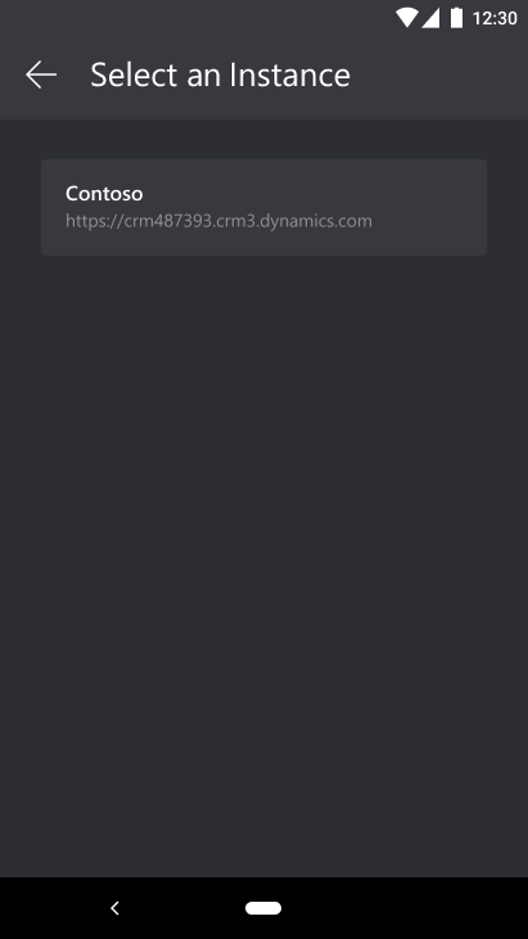

# Dynamics 365 Field Service Integration

###
Empower technicians to solve problems faster by pairing Dynamics 365 Remote Assist Mobile application with the Dynamics 365 Field Service application. This allows technicians to automatically log call information into their Field Service work order when they end the call.

With Dynamics 365 Field Service, technicians manage their assigned work orders, or the service work needed, and perform maintenance and repairs onsite at customer locations. Integrating Dynamics 365 Remote Assist Mobile and Dynamics 365 Field Service, technicians can directly post call metadata from our app to their Field Service work orders without opening their work order.

## Set up Dynamics 365 Field Service Integration (only for Dynamics 365 Field Service customers)
-	Technicians can enable this feature when they first sign into Dynamics 365 Remote Assist Mobile and they will receive a pop-up notification to integrate with Dynamics 365 Field Service.
###

###
-	If they did not enable this feature at first sign in, they can go to **Main Menu** > **Settings** > toggle on **Dynamics 365 Integration**.
###

###

## Dynamics 365 Field Service Integration customer scenario
1.	At the end of a Dynamics 365 Remote Assist Mobile call, you are prompted to post your call metadata to your Field Service work order. Select **Post**.
###

###
2.	If you have **active bookings** assigned to you, you will see them listed. Select your Booking and select **Post**.
###

###
3.	You will return to the **Contact Card** of the expert you called.
###

### 
4.	If you have **no bookings** assigned to your account, you can **Refresh** your screen or **Discard** your post.
###

### 
5.	If you do not see the booking that you are looking for, it might be because you have access to multiple instances (organizations). You can click the **Ellipses** to return to your Instance > select your **Instance** > continue from **Step 2**.
###

### 

> [!TIP]
> Technicians have the ability to initiate a call from the Dynamics 365 Field Service mobile app on their mobile devices to the Remote Assist Mobile app. They can learn how to start a call to an expert on Microsoft Teams [here](making-calls.md). 

### See also 
- Learn more about Remote Assist Mobile [here](remote-assist-mobile-overview.md).
- Learn how to use Remote Assist Mobile's tools through a tutorial [here](learn-the-tools.md).
- Learn how to make calls using Remote Assist Mobile [here](making-calls.md).
- Learn how to annotate your environment on Remote Assist Mobile [here](annotate-your-environment.md).
- Learn how to capture a 2D snapshot and annotate it [here](annotate-snapshot.md).
- Learn how to send chat messages using Remote Assist Mobile [here](send-chat-messages.md).
- Learn how to provide the Remote Assist Mobile team with feedback [here](provide-feedback.md).
