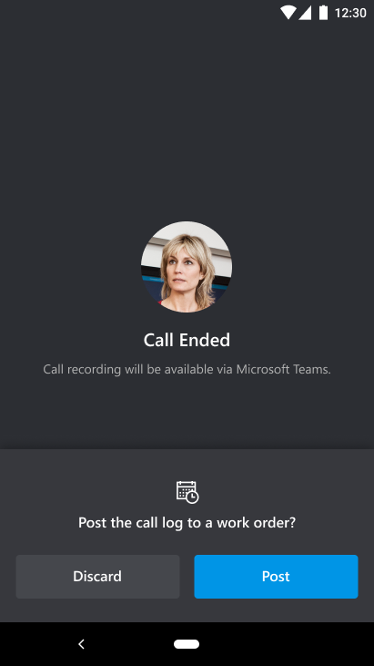
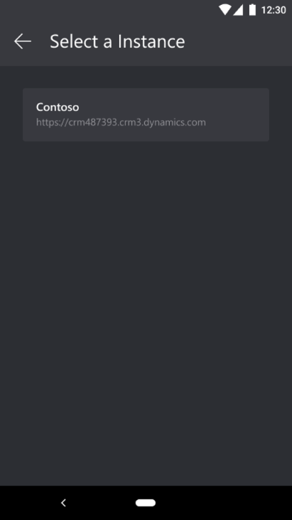
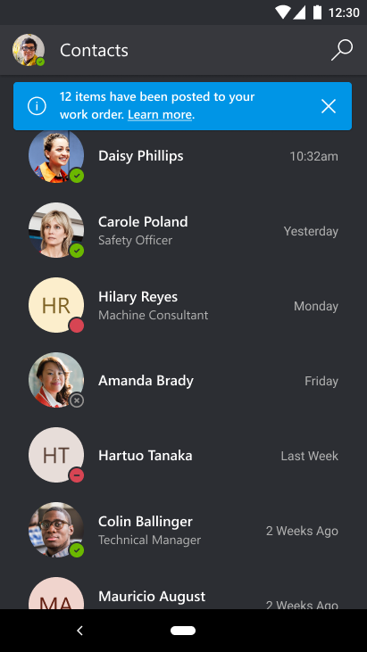

# Use Dynamics 365 Field Service with Remote Assist mobile 

By pairing the Dynamics 365 Remote Assist mobile application with Dynamics 365 Field Service, field service technicians can: 

1. Use Field Service mobile to launch the Remote Assist mobile app and make calls to remote experts on their Android devices.

2. Automatically post **call logs**, such as time, date, call duration, the collaborator's name, and the URLs of the **files, images, and snapshots shared** in the Remote Assist text chat into their Field Service work order at the end of a Remote Assist mobile call.

Organizations with field service needs can seamlessly capture relevant contextual information from their technicians in the field!

## Prerequisites 
- In order to follow along with this guide, you should have completed the setup instructions for Field Service and Remote Assist integration. Learn how to set up the Dynamics 365 Field Service with Remote Assist mobile [here](../troubleshoot-field-service.md). 

## How it works

Now that we have it enabled, let's see how integration with Field Service works for Remote Assist mobile.

1. At the end of a Remote Assist mobile call, you are prompted to post your call log, if no files, images, or snapshots are shared, to your Field Service work order. Select **Post**.

2. If files, images, and/or snapshots are shared in the Remote Assist text chat, you will see a list with your call log and files, images, and/or snapshots that you can post to your Field Service work order. Select **Post All**.
> [!Tip] 
> If you want to post the Remote Assist call recording to your Field Service work order, you can copy and paste the Microsoft Stream URL that will be in your Microsoft Teams chat into your work order. Remember to adjust the Microsoft Stream permissions to allow access to others. 

 

3. If you have **active bookings** assigned to you through Field Service, you'll see them listed. Select your booking and select **Post**.

4. If you have no bookings assigned to your account, you can **Refresh** your screen or **Discard** your post.

5.	If you still don't see the booking you're looking for, it might be because you have access to multiple instances (organizations). You can select the **Ellipses** icon to return to your instance, and then select another **Instance**. Then continue from **Step 3**.

6. You will return to your contact list and you will be notified when your call log and files have successfully been posted to your Field Service work order and then you can sign in to your work order.

7. You can go to the Field Service work order and view the call log and files that have been posted from Remote Assist mobile. Then you can copy and paste the files URL in a new tab to view the files.  
> [!Note] 
> If someone viewing your Field Service work order, such as an admin or dispatcher, wants to view the files, they must request access to your files on OneDrive. 
