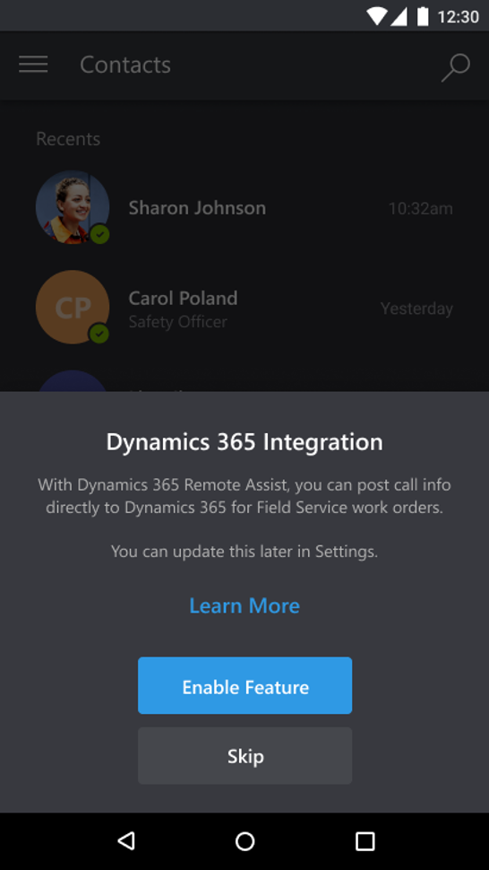
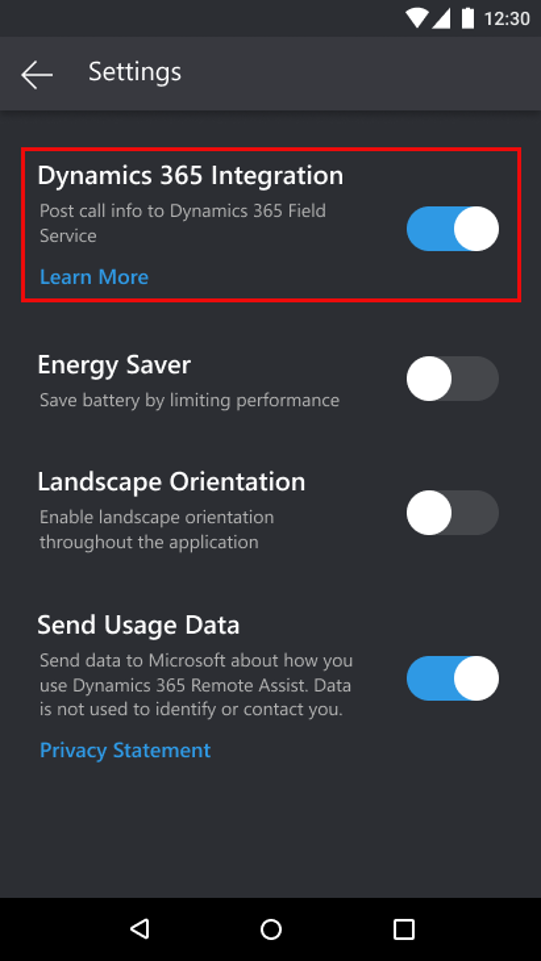
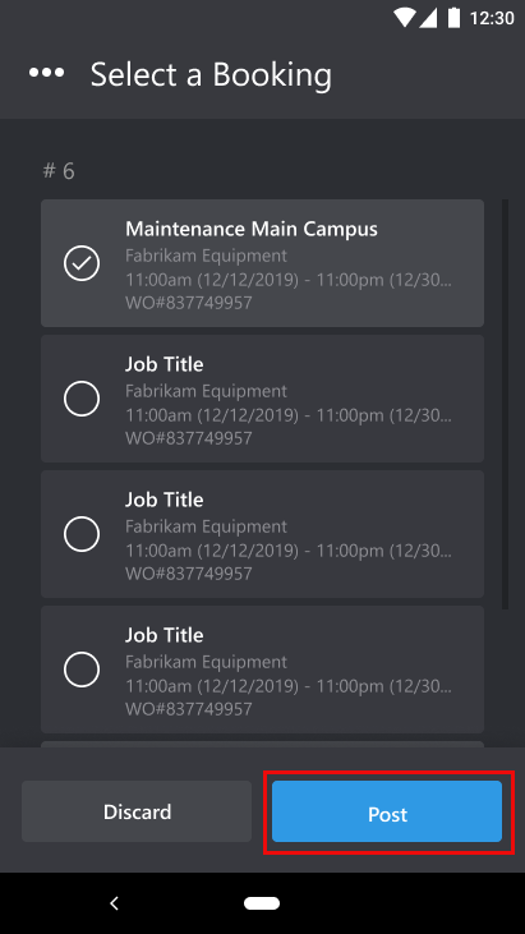

# Dynamics 365 Field Service integration

By pairing Dynamics 365 Remote Assist Mobile application with Dynamics 365 Field Service, technicians can automatically log call information into their Field Service work order when they end a Remote Assist Mobile call.

With Field Service, technicians manage their assigned work orders, or the service work needed, and perform maintenance and repairs onsite at customer locations. Integrating with Remote Assist Mobile means that technicians can directly post call metadata from the Remote Assist Mobile app to their Field Service work orders without even opening the work order.

## Set up integration (Dynamics 365 Field Service customers)

Upon first sign-in to Remote Assist Mobile, technicians will receive a pop-up notification giving them the option to integrate with Dynamics 365 Field Service.

If the technician did not enable this feature at first sign-in, they can go to **Main Menu** > **Settings** and toggle on **Dynamics 365 Integration**.

## How it works

Now that we have it enabled, let's see how integration with Field Service works for Remote Assist Mobile.

1.	At the end of a Remote Assist Mobile call, you are prompted to post your call metadata to your Field Service work order. Select **Post**.

    

2.	If you have **active bookings** assigned to you through Field Service, you'll see them listed. Select your booking and select **Post**.

    

3.	You will return to the **Contact information** for the expert you just got off the call with.

4.	If you have no bookings assigned to your account, you can **Refresh** your screen or **Discard** your post.

5.	If you still don't see the booking you're looking for, it might be because you have access to multiple instances (organizations). You can select the **Ellipses** icon to return to your instance, and then select another **Instance**. Then continue from **Step 2**.
###

### 

> [!TIP]
> Technicians using the Field Service Mobile app on their Android devices can now launch Remote Assist Mobile app and make calls to experts. To learn more, visit the article on [making calls](making-calls.md). 
