# Dynamics 365 Remote Assist for mobile user guide

[!include[cc-microsoft](../../includes/cc-microsoft.md)] [!include[pn-dyn-365-remote-assist](../../includes/pn-dyn-365-remote-assist.md)] for mobile extends the capabilities of [!include[pn-dyn-365-remote-assist](../../includes/pn-dyn-365-remote-assist.md)] to work with [!include[tn-android](../../includes/tn-android.md)] or iOS phones or tablets (in addition to [!include[cc-microsoft](../../includes/cc-microsoft.md)]  [!include[pn-HoloLens](../../includes/pn-HoloLens.md)]). Technicians can use their phone or tablet to connect and collaborate with an 
expert on [!include[pn-microsoft-teams](../../includes/pn-microsoft-teams.md)]. Using live video calling and annotations, they can share what they see with the expert to troubleshoot problems together, faster. 

## What you’ll need

You’ll need the following to use [!include[pn-dyn-365-remote-assist](../../includes/pn-dyn-365-remote-assist.md)] for mobile:

- An [!include[tn-android](../../includes/tn-android.md)] or iOS device. Dynamics 365 Remote Assist for mobile supports both AR and non-AR devicies. With non-AR devices, you can use 2D annotations:
  - [View the full list of AR-supported Android devices](https://developers.google.com/ar/discover/supported-devices)

  - [Learn more about augmented reality on iOS](https://www.apple.com/ios/augmented-reality/)

- A [!include[tn-google](../../includes/tn-google.md)] Play or Apple Store account.

- [!include[pn-dyn-365-remote-assist](../../includes/pn-dyn-365-remote-assist.md)] for mobile.

- A [!include[pn-dyn-365-remote-assist](../../includes/pn-dyn-365-remote-assist.md)] license (free trial available).

- A [!include[pn-microsoft-teams](../../includes/pn-microsoft-teams.md)] account (available for free).

- A [!include[pn-microsoft-teams](../../includes/pn-microsoft-teams.md)] desktop client running [!include[pn-ms-windows-short](../../includes/pn-ms-windows-short.md)] 10 (for the remote expert receiving the call).

- An internet connection. At least 1.5 MB of bandwidth is recommended for the best experience.

If you want to use [!include[pn-dyn-365-remote-assist](../../includes/pn-dyn-365-remote-assist.md)] together with [!include[pn-dyn-365-field-service](../../includes/pn-dyn-365-field-service.md)] so you can automatically log call information to a 
[!include[pn-field-service](../../includes/pn-field-service.md)] work order, you’ll also need one or both of the following:

- [!include[pn-dyn-365-field-service](../../includes/pn-dyn-365-field-service.md)] web application

- [!include[pn-dyn-365-field-service](../../includes/pn-dyn-365-field-service.md)] mobile app 

## Get started

### Step 1: Sign up for a Microsoft Teams account (free)

A [!include[pn-microsoft-teams](../../includes/pn-microsoft-teams.md)] account is required to use [!include[pn-dyn-365-remote-assist](../../includes/pn-dyn-365-remote-assist.md)] for mobile. If you don’t already have a [!include[pn-teams](../../includes/pn-teams.md)] account, you can [create a Teams account for free](https://businessstore.microsoft.com/en-us/create-account/signup?products=CFQ7TTC0K8P5:0001&lm=deeplink&lmsrc=freePageWeb&cmpid=FreemiumSignUpHeader). 

### Step 2: Download the app

1.	Go to the [Google Play Store](https://play.google.com/store/apps/details?id=com.microsoft.ramobile) or [Apple Store](https://go.microsoft.com/fwlink/?linkid=2100645).

2.	Select **Download**. 
 
### Step 3: Sign in to the app for the first time

1.	After you’ve downloaded the app, open it on your phone or tablet. 

2.	Sign in with your [!include[pn-microsoft-teams](../../includes/pn-microsoft-teams.md)] account.

    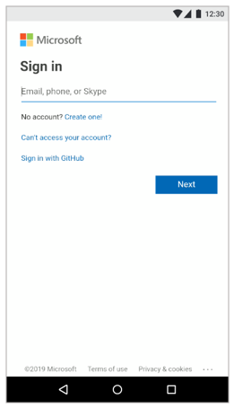
  
    > [!TIP]
    > The sign-in address will be in the form: username@company.
    
3.	In the dialog box that appears, select **Enable Feature** to link [!include[pn-dyn-365-remote-assist](../../includes/pn-dyn-365-remote-assist.md)] to [!include[pn-dyn-365-field-service](../../includes/pn-dyn-365-field-service.md)], or 
select **Skip** if you don’t want to link the apps at this time. You can always link them later through **Settings**. To learn more about how the apps work together, select **Learn More**.

   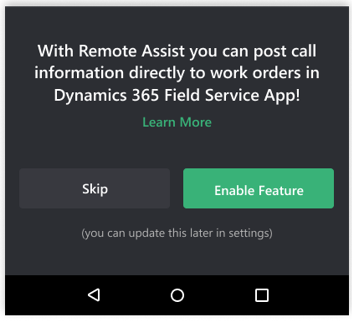
   
4. If you don't have a [!include[pn-dyn-365-remote-assist](../../includes/pn-dyn-365-remote-assist.md)] license, another dialog box will prompt you to get a license or to sign up for a free trial.
  
## View a quick tutorial to jumpstart your learning curve

Dynamics 365 Remote Assist for mobile includes a tutorial that you can use to jumpstart your learning curve. You can start the tutorial by selecting the **Try It** button when you sign in.

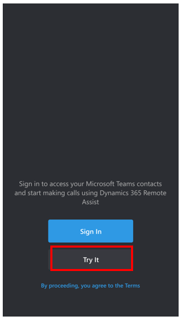

You can also start the tutorial by selecting the Main menu button, and selecting **Learn the tools**.

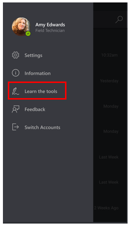

## Make a call
After signing in, you’ll see the **Contacts** page, which is the main page in [!include[pn-dyn-365-remote-assist](../../includes/pn-dyn-365-remote-assist.md)] for mobile. On the **Contacts** page, 
your contacts are organized by the most recent calls.

To make a call:

1.	Select , enter the name of the contact to search for, and then select the contact from the resulting list.
       
    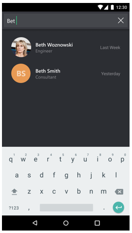
    
2.	In the contact card, select **Launch Call**.

    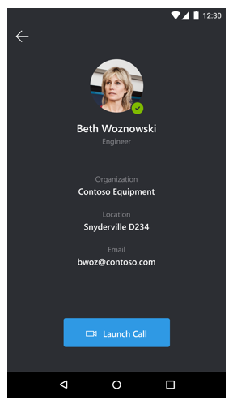
  
    Use the buttons in the bar at the bottom of the screen to mute the call, pause the video feed, turn on the speaker phone, or 
    end the call.
    
    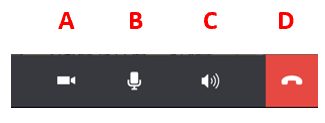
    
    A. Pause video feed 
    B. Mute call 
    C. Turn on speaker phone 
    D. End call
  
 
## Add annotations
You can add annotations to your screen to share with an expert on the call. To create annotations, your phone or tablet needs to recognize 
at least one plane (vertical or horizontal) in your work area. You do this by scanning your work area with the phone or tablet. When a plane has been recognized, you’ll see a confirmation visualization and the annotation toolbar will appear at the top of the screen:

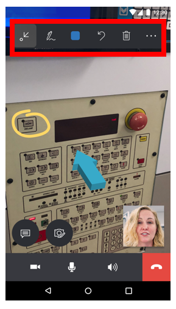
  
> [!NOTE] 
> If you lock your phone or tablet, or minimize [!include[pn-dyn-365-remote-assist](../../includes/pn-dyn-365-remote-assist.md)] for mobile, the recognized planes will reappear automatically as soon as your phone or tablet recognizes the environment.

### Add an augmented reality annotation

You can add an augmented-reality annotation by using the buttons on the annotation toolbar:

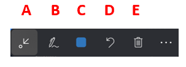

A. Add arrow 
B. Add ink 
C. Change color of arrow or ink 
D. Undo last action 
E. Delete everything on screen, including expert's annotations
  
For example, to add an arrow, tap the arrow tool and drag your finger to the spot where you want to place the arrow.

### Add a 2D annotation

You can also annotate in 2D by toggling augmented reality off or by taking a picture.

When augmented reality is turned off, the Camera button turns into a check mark. 

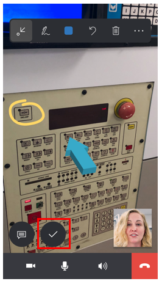

You may want to use 2D:

- To increase performance and save battery

- To increase accuracy of annotations

- If your device does not support augmented reality

### Make the expert’s video feed bigger

When you call an expert, the expert’s video feed appears in the lower-right corner of your phone or tablet screen. To make the expert’s 
video feed bigger, tap the feed. Tap the feed again to return to the original size.

  
If the expert is annotating, a notification icon will appear on the expert's feed.  

## Switch the camera view from portrait to landscape

You can switch the orientation of the camera view from portrait to landscape while in a call by changing the orientation of your phone or tablet. Using landscape view provides a wider field of view, which may improve the experience for the remote expert on the call.

## Send a text message

You can also communicate through Teams chat with the person you're calling. A popup appears for any messages you receive or you can open the text chat window to send a message to the other person. 

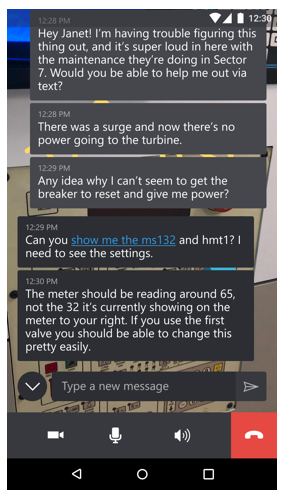
   
## Use Remote Assist together with Dynamics 365 Field Service

You can use [!include[pn-dyn-365-remote-assist](../../includes/pn-dyn-365-remote-assist.md)] together with [!include[pn-dyn-365-field-service](../../includes/pn-dyn-365-field-service.md)] if you want to automatically log call information to a 
[!include[pn-field-service](../../includes/pn-field-service.md)] work order when you end the call. 

When you sign in to [!include[pn-dyn-365-remote-assist](../../includes/pn-dyn-365-remote-assist.md)] for mobile for the first time, you’re prompted to link [!include[pn-dyn-365-remote-assist](../../includes/pn-dyn-365-remote-assist.md)] to [!include[pn-dyn-365-field-service](../../includes/pn-dyn-365-field-service.md)]. You can link the apps through **Settings** if you chose not to link them at first sign-in.

### Link Dynamics 365 Remote Assist for mobile to Dynamics 365 Field Service

1.	Select the **Main menu**  button.

2.  Select the **Settings** button.  

3.	In the **Settings** dialog box, move the slider to on.

    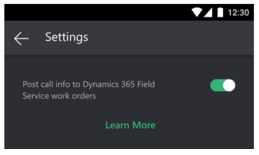
  
### Save call data to a Dynamics 365 Field Service work order

1.	When you end the call, the following dialog box will appear:

    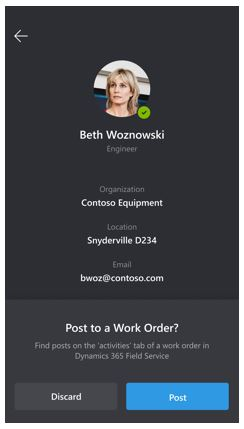
  
2.	Select **Post**.

3.	In the **Select one of today's bookings** screen, select the appropriate booking to post the call data to.

    
  
    > [!NOTE]
    > If you don’t see the booking you’re looking for, it might be because you have access to multiple instances (organizations). 
    To switch to a different instance, select the ellipsis button (...), and then select the instance you want. 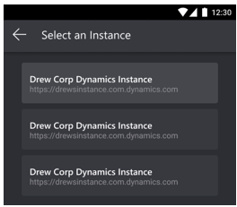
    
## Sign out of the app

1.	Select the **Main menu**  button.

2.	Select **Sign Out**.

## Get Help

1.	Select the **Main menu**  button.

2.	Select **Help**.

## Get support or provide feedback

If you’d like access to the product forum or to leave feedback on the app, go to [Dynamics 365 Remote Assist Community](https://community.dynamics.com/365/remoteassist/).

You can also provide feedback directly from the app by using the following procedure:

1.	Select the **Main menu**  button.

2.	Select **Feedback**.

### See also

[Integrate Dynamics 365 Field Service with Dynamics 365 Remote Assist](../troubleshoot-field-service.md)
