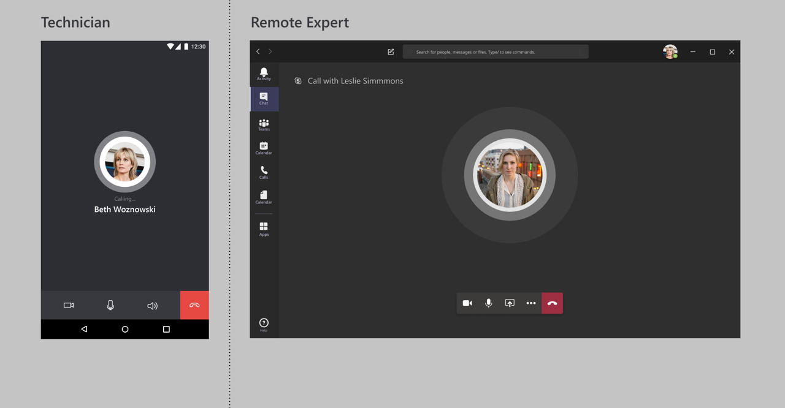
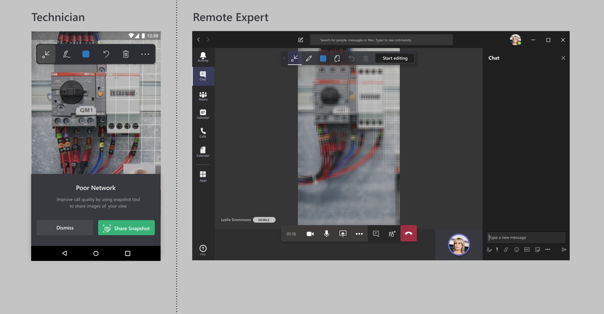
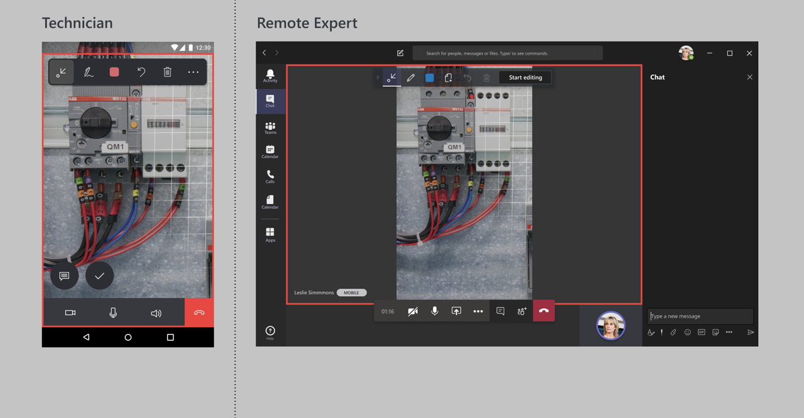

# Poor Network Connectivity

###
Most of our technicians work on factory floors or remote locations without strong network connectivity. The lack of strong network connectivity inhibits our technicians from troubleshooting and resolving problems in real-time. Now, Remote Assist Mobile provides technician with the ability to discuss, diagnose, and resolve issues with remote experts even in low bandwidth scenarios.

If the bandwidth is between 128 kbps and 1.5 Mbps, the latency is higher than 1,000 ms, or the packet loss higher than 10%, it is considered poor network.

This feature auto-detects if the technician is experiencing poor network conditions. If the poor netwoork requirements are met, the technician is prompted to share snapshots with the remote expert to collaborate, instead of transmitting a live video feed. Now, the expert can view and annotate images of better quality, instead of viewing a low-quality video.

### Individual Poor Network Requirements
- Minimum bandwidth  (in/out) - 150 kbps / 150 kbps
- Maximum latency  (in/out) - 500 ms / 500 ms (1,000 ms) 
- Maximum packet loss (in/out) - 10% / 10%  
	
Poor network takes into account the interaction of the three components: **bandwidth**, **latency**, and **packet loss**. Here's an example of a very bad network profile that allows users to sign into Remote Assist Mobile and connect to a call with an expert.

### Poor Network Profile     
| Variables  | Measurements |
| ------------- | ------------- |
| Bandwidth  | 150 kbps / 150 kbps  |
| Latency  | 400 ms / 400 ms = 800 ms  |
| Packet loss  | 10% / 10%  |

> [!NOTE]
> Given the above known values for **Bandwidth** and **Packet Loss**, exceeding a round trip **Latency** of 800 ms will result in the a slower in-app experience. These variables are interdependent and the change in one variable can affect the other variables. 

## Poor network connectivity customer scenario

1. The technician launches a video call with a remote expert.
###
 
###
2. In the call, Remote Assist Mobile **auto-detects** if the technician is experiencing poor network conditions. 
###
 
###
3. It prompts the technician to use the **snapshot tool** to share images to the expert.
###
 
###
4. The technician is instructed to use the **snapshot tool**.
###
 
###  
5. The technician takes a snapshot and it is shared to the expert's screen. **The expert now sees a snapshot of better quality!**
###
 
### 
6. The technician and expert can **annotate simultaneously** on the snapshot.
###
 
###
7. After sharing a snapshot, the technician can save it to the mobile device's **Photo Gallery** or **discard it**.
###
 
###
8. The technician now returns to the video call and can continue to send snapshots to the expert.
###
 
###
