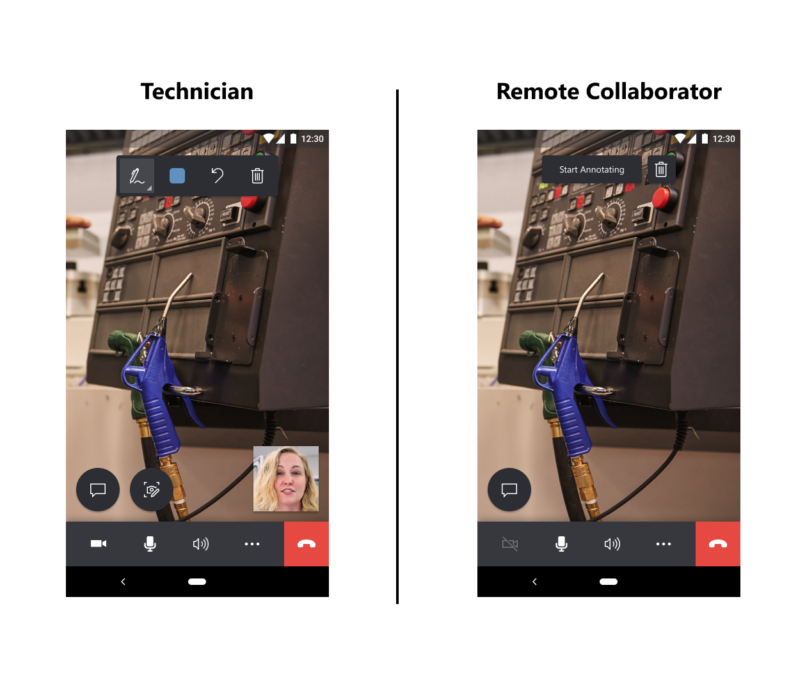

# Make Remote Assist mobile calls with augmented reality supported devices

Remote Assist mobile makes conducting repairs and remote inspections easy by providing technicians with the ability to launch one-to-one video calls with remote collaborators inside or outside of their organization. Making calls with Remote Assist mobile is available in these three scenarios: 
1. A call between two Remote Assist mobile users
2. A call between a Remote Assist mobile user and a Teams desktop user
3. A call between a Remote Assist mobile user and a Teams mobile user

> [!NOTE] 
> The following scenarios are **not** supported on Remote Assist mobile at this time:
> - Joining Teams meetings.
> - Making calls to browser-based Teams.
> - Participating in calls with three or more participants.
> - Participating in Remote Assist mobile to Remote Assist on HoloLens calls.

## Prerequisites
- In order to follow along with this guide, you must be using a mobile device with ARCore or ARKit support. Learn about Remote Assist's device [requirements](https://docs.microsoft.com/dynamics365/mixed-reality/remote-assist/requirements).
- Technicians must have a Dynamics 365 Remote Assist [free trial](https://docs.microsoft.com/dynamics365/mixed-reality/remote-assist/try-remote-assist) or [subscription](https://docs.microsoft.com/dynamics365/mixed-reality/remote-assist/buy-remote-assist).
- Remote collaborators must have a Dynamics 365 Remote Assist free trial or subscription and/or Microsoft Teams [free trial or subscription](https://www.microsoft.com/microsoft-365/microsoft-teams/group-chat-software). Learn to set up Remote Assist with [Teams desktop](https://docs.microsoft.com/dynamics365/mixed-reality/remote-assist/teams-pc-all) and [Teams mobile](https://docs.microsoft.com/dynamics365/mixed-reality/remote-assist/teams-mobile-all).

## How it works 

1. Launch and sign into Remote Assist on your iOS or Android device. 
   
2. Search for the remote collaborator's name. 

3. Select the remote collaborator's name and launch a call. 

4a. If the remote collaborator answers the call on **Remote Assist mobile**, the technician's live video feed will be shared to the remote collaborator's device screen. 

4b. If the remote collaborator answers the call on **Teams desktop**, the technician's live video feed will be shared to the remote collaborator's device screen. 

5. With the call controls toolbar, the technician can disable the video call (enter an audio-only call), mute themselves in call, turn on their speakers, or end the call. 

## See also
- Learn how to make calls on Remote Assist mobile **without** ARCore or ARKit support [here](https://docs.microsoft.com/dynamics365/mixed-reality/remote-assist/mobile-app/using-devices-without-ar).
- Learn how to place mixed reality annotations in the shared environment [here](https://docs.microsoft.com/dynamics365/mixed-reality/remote-assist/mobile-app/annotate-your-environment).
