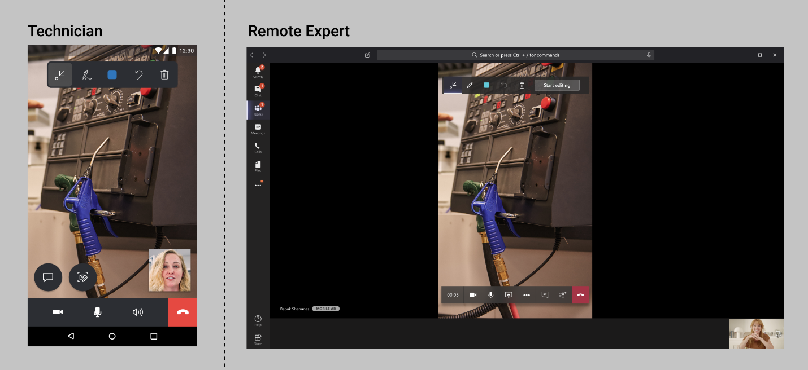

# Making calls in Dynamics 365 Remote Assist Mobile 

Remote Assist Mobile makes receiving expert help easy by providing technicians with the ability to launch video calls with experts who are using Microsoft Teams desktop or mobile. Technicians can make calls to an expert inside or outside of their company. To learn more about how the remote experts communicate via Teams, visit our documentation on [using Teams with Remote Assist](use-microsoft-teams-with-remote-assist.md).

For a successful calling experience, **only a Remote Assist Mobile user (technician) can initiate an outgoing call to either one Teams desktop user (expert) or one Teams mobile user (expert)**.

>[!NOTE]
> Remote Assist Mobile does not currently support the following features, but these features are on the product roadmap:
> -	Joining Teams meetings.
> -	Making calls to browser-based Teams.
> -	Participating in calls with three or more participants.
> -	Participating in Remote Assist Mobile to Remote Assist Mobile calls.
> -	If the Remote Assist Mobile app is not open, the technician will not receive incoming call notifications from Teams desktop or mobile.

## Prerequisites
- Technicians must have a Remote Assist license. Visit our additional documentation to learn more about the [free trial licenses](try-remote-assist.md) or [subscriptions](buy-remote-assist.md).
- Experts must have a Microsoft Teams license. Learn more [here](use-microsoft-teams-with-remote-assist.md).

## How it works

1. Launch and sign into Remote Assist Mobile on your iOS or Android device. 
   
2. Search for the expert’s name. 

3. Select the expert’s name and launch a call with the expert. 

4. The expert will receive the call on Microsoft Teams. 

5. The expert will be taken to the technician's live video feed. 

6. With the call controls toolbar, Remote Assist Mobile users can disable the video call (enter an audio-only call), mute themselves in call, turn on their speakers, or end the call. 

