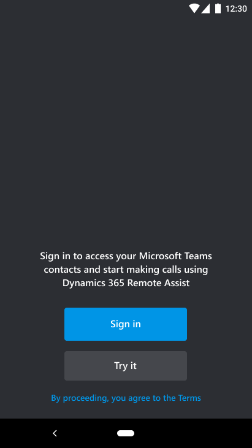
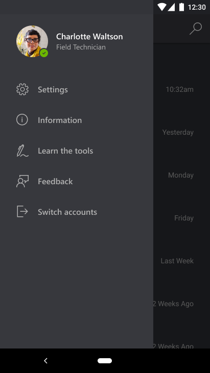
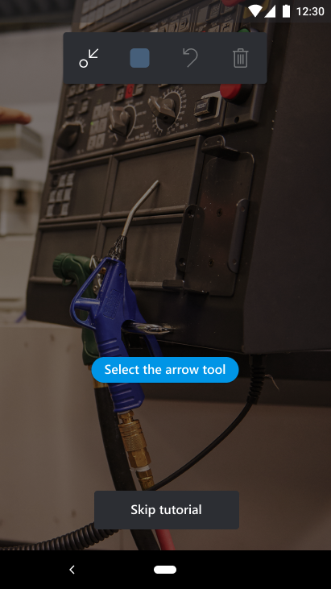
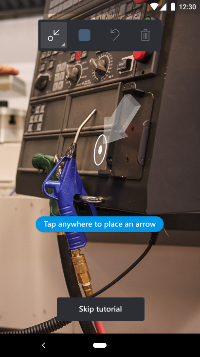
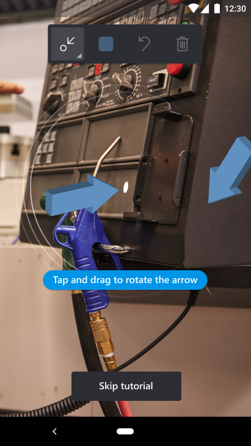
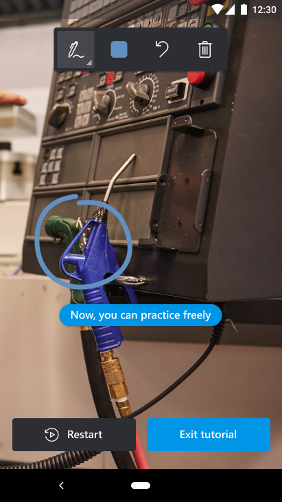
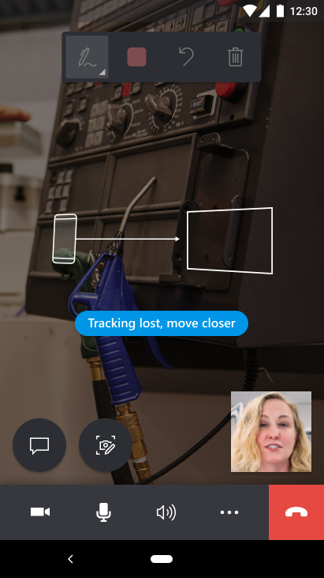
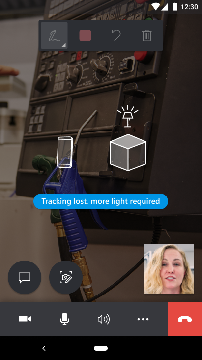

# Use the in-app tutorial on Dynamics 365 Remote Assist mobile

Technicians can use Dynamics 365 Remote Assist mobile's in-app, guided tutorial to jump-start their ability to use its augmented reality (AR) capabilities. With AR, technicians to share their real-world environments and connect with remote collaborators to walk through the repair or inspection process. Both call participants can better reference objects and provide instructions by placing mixed reality annotations into the technician's shared environment.

This guided tutorial addresses:

1. Learn to move your device around so that Dynamics 365 Remote Assist mobile can detect the technician's surroundings and surfaces for better mixed reality annotation placement experience

2. Place and manipulate mixed reality annotations, such as the arrow and the ink tools.

## Prerequisites

- In order to follow along with this guide, you should have a using a **mobile device with ARCore or ARKit support**. Learn more about the device requirements [here](https://docs.microsoft.com/dynamics365/mixed-reality/remote-assist/requirements).

>[!Note]
> No AR capabilities? No problem! Dynamics 365 Remote Assist mobile is available on unsupported AR mobile devices, too; learn more about using Dynamics 365 Remote Assist mobile on unsupported AR devices [here](../mobile-app/using-devices-without-AR.md).

## How it works

1. To launch the tutorial, select **Try It** on the **Sign in** screen.

2. If you're already signed in and wish to launch the tutorial, you can also go to **Menu** > **Learn the Tools**. 

3. Once you have begun the tutorial, you're prompted with an animation to move your phone side-to-side for better surface detection. Complete this action. 

4. Select the **Arrow tool** to place the arrow tool.

5. Place the arrow in your environment by tapping anywhere on your screen. 

6. Tap and drag to **rotate** the arrow. 

7. Select the **Inking tool**.

8. Draw a line or circle by tapping and dragging on your screen. 

9. Practice placing and using other annotations. You can use the **Color picker**, **Undo**, or **Delete all** annotation icons. 

## Techniques to improve surface detection

- Move your phone from side-to-side at the beginning of a video call.
- Try moving your phone more slowly.
- Place annotations in your device's field of view and avoid lots of sudden movements.
- Avoid frequently minimizing the app and reopening it while there are annotations present.

## Limitations that may hinder accurate surface detection

- Flat surfaces without texture, such as a white desk.
- Environments with dim lighting or very bright lighting.
- Transparent or reflective surfaces like glass.
- Dynamic or moving surfaces.

## How to resolve error messages

Throughout the tutorial or during the call, technicians may be prompted that they have "**lost tracking**" because Dynamics 365 Remote Assist has not adequately detected their surroundings or surfaces. In this case, technicians will be unable to place any mixed reality annotations until their surfaces are detected. Let's look at a few ways technicians can better track their environment.

> [!NOTE]
> Remote collaborators won't be able to place mixed reality annotations when the technician has lost tracking.

1. Move your device from **side-to-side** to better detect your surroundings or surfaces.

2. Move your device **further away**.

3. Move your device **closer**.

4. Try **turning on some lights** to brighten dimly lit spaces.

