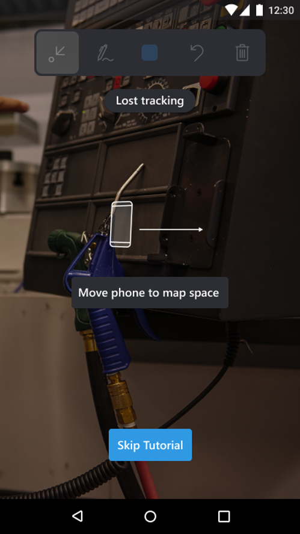

# Understanding augmented reality (AR) capabilities on Remote Assist mobile through the in-app tutorial

Augmented reality (AR) creates immersive and engaging collborations between two people by blending virtual objects with the real world. Remote Assist mobile uses AR for technicians to share their environments and connect with remote collaborators to walk through the repair or inspection process. Both call participants can better reference objects and provide instructions by placing mixed reality annotations into the technician's shared environment. 

To better understand Remote Assist mobile's AR capabilities, technicians can use the **in-app, guided tutorial** to jumpstart their ability to use our app. This guided tutorial includes:

1. Before technicians can enjoy an AR experience in our app, they need to **move their mobile device around which lets ARKit/ARCore evaluate the surroundings and detect surfaces**. By detecting the technicians' surroundings and surfaces, both the technician and remote collaborator can more accurately place mixed reality annotations in their environment. 
2. **Place and manipulate mixed reality annotations**, such as the arrow and the ink tools.

### Techniques to **improve** the surroundings and surface detection
- Move your phone from side-to-side at the beginning of a video call.
- Try moving your phone more slowly.
- Place annotations in your device's FOV and avoid lots of sudden movements.
- Avoid frequently minimizing the app and reopening it while there are annotations present.

### **Limitations** that may hinder accurate surroundings and surface detection
- Flat surfaces without texture, such as a white desk.
- Environments with dim lighting or extremely bright lighting.
- Transparent or reflective surfaces like glass.
- Dynamic or moving surfaces.

### Prerequisites 
- For technicians to be able to enjoy the AR capabilities on Remote Assist mobile, they must be using an **AR capable mobile device**; learn more about the device requirements [here](https://docs.microsoft.com/dynamics365/mixed-reality/remote-assist/requirements). Don't worry, Remote Assist mobile is available on unsupported AR mobile devices, too; learn more about using Remote Assist mobile on unsupported AR devices [here](mobile-app/using-devices-without-AR.md). 
###

## How it works

1. To launch the tutorial, select **Try It** on the **Sign in** screen.

2. If you're already signed in and wish to launch the tutorial, you can also go to **Menu** > **Learn the Tools**. 

3. Once you have begun the tutorial, you're prompted with an animation to move your phone side-to-side for better surface detection. Complete this action. 

4. Select the **Arrow tool** to place the arrow tool.

5. Place the arrow in your environment by dragging and dropping it to anywhere on your screen. 

6. Select the **Inking tool**.

7. Draw a line or circle by tapping and dragging on your screen. 

8. Practice placing and using other annotations. You can use the **Color picker**, **Undo**, or **Delete all** annotation icons. 

## How to resolve error messages 

Throughout the tutorial or during the call, technicians may be prompted that they have "**lost tracking**" because Remote Assist does not adequately detected their surroundings or any surfaces. Thus, the technicians will be unable to place any mixed reality annotations until their surfaces are detected. Below are the actionable animations to illustrate to technicians to track their environment better.

> [!NOTE] Remote collaborators will not be able to place mixed reality annotations when the technician has lost tracking. 

1. Move your device from **side-to-side** to better detect your surroundings or surfaces.

2. Move your device **further away**.

3. Move your device **closer**.

4. Try **turning on some lights** to a dimly lit space.
