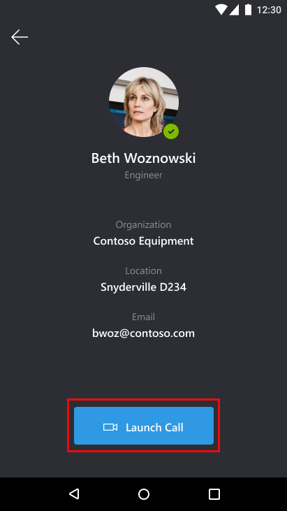
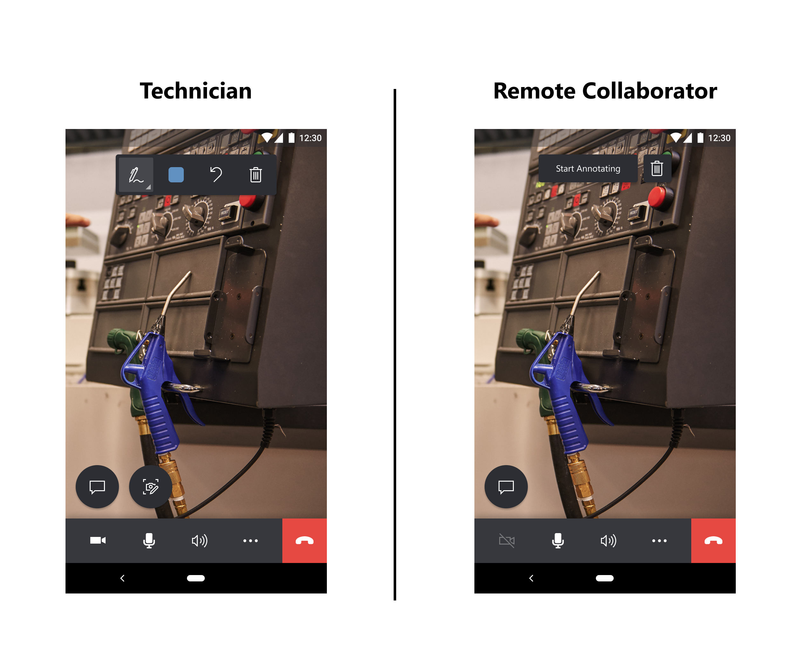
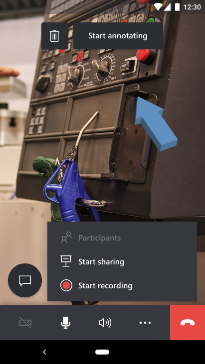
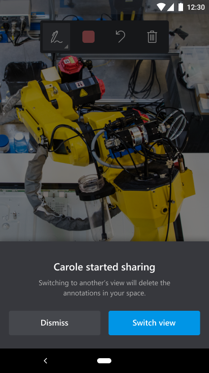
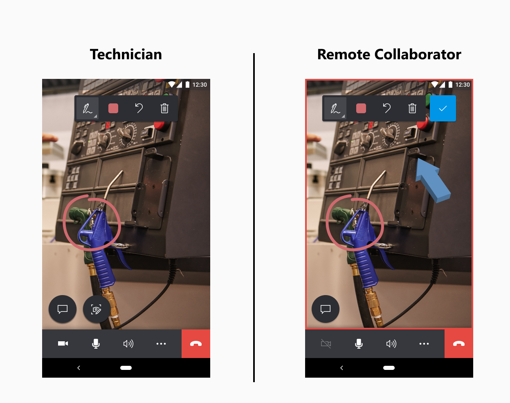

# Calls between Dynamics 365 Remote Assist mobile users

Technicians using Dynamics 365 Remote Assist mobile can now call and collaborate with other Dynamics 365 Remote Assist mobile users! This opens up many new scenarios for technicians, including peer-to-peer collaboration with other technicians using Dynamics 365 Remote Assist mobile rather than Microsoft Teams desktop or mobile.

A Dynamics 365 Remote Assist mobile user can join a one-to-one or group calls with other Dynamics 365 Remote Assist mobile users. 

> [!NOTE]
> This guide documents a call between two Dynamics 365 Remote Assist mobile users; learn about group calls with at least three Dynamics 365 Remote Assist mobile users [here](group-calling.md).

## Prerequisites

- Call receivers must **not** have the Microsoft Teams application on their mobile devices. 

- Technicians must have a Dynamics 365 Remote Assist [free trial](https://docs.microsoft.com/dynamics365/mixed-reality/remote-assist/try-remote-assist) or [subscription](https://docs.microsoft.com/dynamics365/mixed-reality/remote-assist/buy-remote-assist).

- Remote collaborators must have a Dynamics 365 Remote Assist free trial or subscription and a Microsoft Teams [free trial or subscription](https://www.microsoft.com/microsoft-365/microsoft-teams/group-chat-software). Learn to set up Dynamics 365 Remote Assist with [Teams desktop](https://docs.microsoft.com/dynamics365/mixed-reality/remote-assist/teams-pc-all) and [Teams mobile](https://docs.microsoft.com/dynamics365/mixed-reality/remote-assist/teams-mobile-all).

## How it works

1. Launch and sign into Dynamics 365 Remote Assist on your iOS or Android phone or tablet.

2. Search for the remote collaborator's name.

    

3. Select the remote collaborator's name and launch a call.

   > [!NOTE]
   > If the remote collaborator is receiving the call on a mobile device with both Dynamics 365 Remote Assist mobile and Teams mobile installed, the remote collaborator can only answer on Teams mobile. 

    

4. If the remote collaborator answers the call on **Remote Assist mobile**, the technician's live video feed will be shared to the remote collaborator's device screen.

    

5. If the remote collaborator wants to share their own environment, the remote collaborator can select the **Ellipses** > **Start Sharing**.

    

6. When the remote collaborator starts sharing their space, the technician can view the remote collaborator's space when they start sharing it. Select **Switch view** or **Dismiss**.

    

7. Both call participants can place annotations in the shared environment either in their own environment or by selecting **Start Annotating**. 

    > [!NOTE] 
    > After the remote collaborator selects **Start Annotating**, they can add mixed reality annotations on a frozen frame of the shared environment. Afterwards, they can select the **Check Mark** and then the annotation will appear in the technician's shared environment.

    

8. With the call controls toolbar, the technician can disable the video call (enter an audio-only call), mute themselves in call, turn on their speakers, record the call, share their environment, or end the call. 

    

9. During the call, call participants capture and annotate on snapshots, send messages, share files, record the call, and more!

## FAQ 

## If remote collaborators (call receivers) have both Dynamics 365 Remote Assist mobile and Teams mobile installed on their devices, can they answer the call on Dynamics 365 Remote Assist mobile? 

If you receive an incoming call on a device with both Dynamics 365 Remote Assist and Teams mobile installed, the call will be received on Teams mobile. To receive the incoming call notification on Dynamics 365 Remote Assist mobile, Teams mobile must not be installed on your device.

> [!NOTE] 
> When a Dynamics 365 Remote Assist mobile calls a remote collaborator and the remote collaborator answers on Teams mobile, the remote collaborator will have the same capabilities as they would if they answered on Dynamics 365 Remote Assist mobile, except that the remote collaborator cannot share their space.

[!INCLUDE[footer-include](../../includes/footer-banner.md)]
