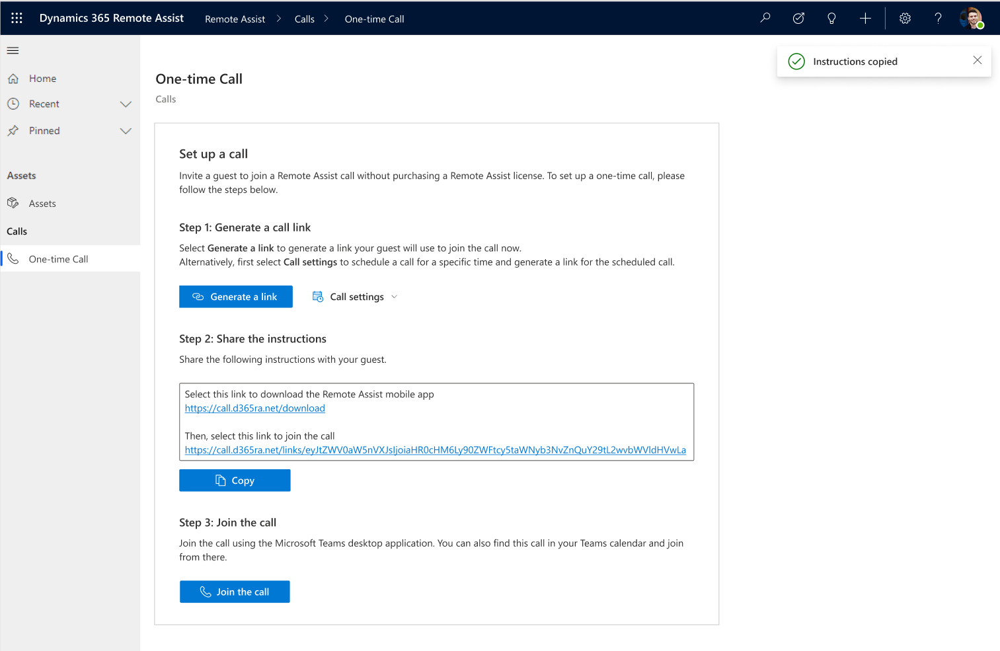
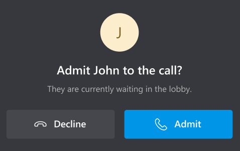
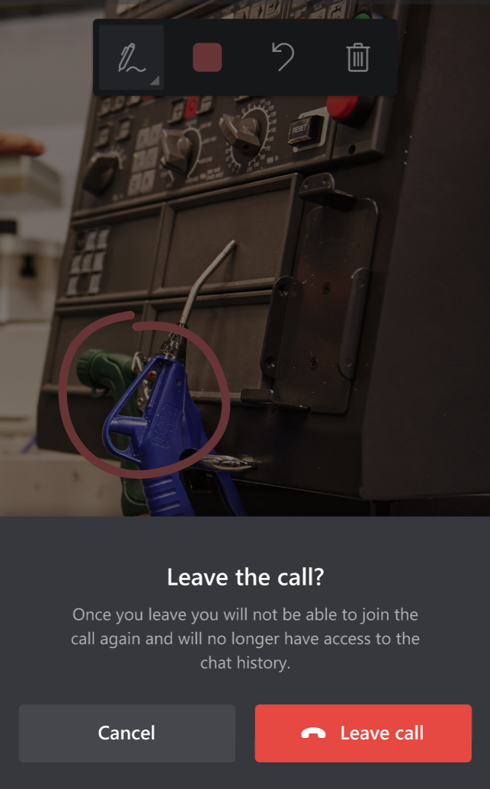
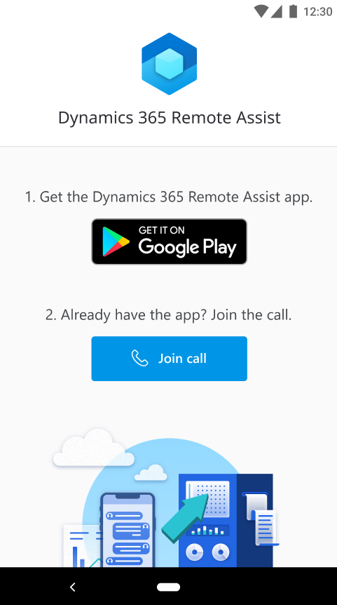

# Invite user to join a one-time call (public preview)

> [!IMPORTANT] 
> A preview feature is a feature that is not complete, but is made available before it’s officially in a release so customers can get early access and provide feedback. Preview features aren’t meant for production use and may have limited or restricted functionality. Microsoft doesn't provide support for this preview feature. Microsoft Dynamics 365 Technical Support won’t be able to help you with issues or questions. Preview features aren't meant for production use and are subject to a [separate supplemental terms of use](https://docs.microsoft.com/dynamics365/legal/supp-dynamics365-preview).

## Scenarios overview 
There are several scenarios in which a Remote Assist user may want to enable an external user without a Remote Assist license or Teams license--such as a B2B vendor, B2B customer, or B2C customer--to join a Remote Assist call on an ad-hoc, one-time basis. For example, a customer service agent may want to transition from a phone call to a mixed reality video call to visually assess a product, and overlay mixed reality instructions to guide their customer through the repair in real time. This document will use the term “agent” to refer to the licensed Remote Assist user, and “customer” to refer to the unlicensed external user. 

Additional scenarios include: 
* A customer service agent received a request from a customer for a contactless design consultation before remodeling their kitchen. The agent wants to view their customer’s kitchen and provide ideas for products that would look good together. The agent provides their customer with a link to join the scheduled consultation via a Remote Assist call.
* A technician is repairing an asset, and wants to receive assistance from the asset’s original equipment manufacturer (OEM).

Note that in these scenarios, the external user only needs to **join** a Remote Assist call on an ad-hoc, one-time basis. The external user **does not need to initiate a call or use Remote Assist’s out-of-call asset capture functionalities.** 

Any licensed Remote Assist user can use the Remote Assist web app via their desktop (or mobile) browser to generate a one-time call link. The licensed Remote Assist user can share the link with an external user using their preferred communication platform (e.g., email, SMS, [Dynamics 365 Omnichannel channels](https://docs.microsoft.com/dynamics365/omnichannel/introduction-omnichannel#channels-available-with-omnichannel-for-customer-service)). The external user can join the call using the Remote Assist mobile app (or, in some scenarios, the Teams desktop app).

## Requirements  
* [Set up your Dynamics environment](ra-webapp-install.md)
* The agent must use the Remote Assist web app on a [compatible browser](https://docs.microsoft.com/power-platform/admin/web-application-requirements)
* Enable pop-ups for https://call.d365ra.com and for your organization’s tenant-specific environment URL on the browser the agent will use to access the Remote Assist web app. Pop-ups will be used for authentication purposes.
* The agent must be configured to have a Microsoft Exchange Online calendar.
* The agent’s organization must [enable anonymous users to join Teams meeting](https://docs.microsoft.com/microsoftteams/meeting-settings-in-teams#allow-anonymous-users-to-join-meetings).
* If an agent wants to manually admit a customer into the call, the agent’s organization must [configure their Teams meetings settings](https://docs.microsoft.com/microsoftteams/meeting-policies-in-teams#automatically-admit-people) such that **Everyone in your organization and federated organizations bypasses the lobby**, or enable **Everyone in your organization bypasses the lobby**.

> [!Note]
> One Time Call is available in all CDS regions except for GCC and GCCHigh.

## Agent experience 

|     Before selecting Generate a link on the desktop web app     |     After selecting Generate a link and Copy on the desktop   web app    |  
|-----------------------------------------------------------------|--------------------------------------------------------------------------|
|  | | 

	 
### Step 1: Generate a call link
Navigate to your organization’s environment, log in, and select **Dynamics 365 Remote Assist**. Then, select **One-time Call**. Please contact your administrator for your tenant-specific environment URL.

Select **Generate a link** to generate a link your customer will use to join the call now. When you select **Generate a link**, you may see two pop-ups appear and then close automatically. In addition, a meeting will appear on your Teams calendar. By default, the meeting is named Remote Assist call, and is scheduled to start at the upcoming 15-minute mark and last for 15 minutes. 

Alternatively, first select **Call settings** to schedule a call for a specific time and generate a link for the scheduled call. When you select Generate a link, a meeting will appear on your Teams calendar with the name, date, start time, and end time you selected.  

### Step 2: Share the instructions
After you successfully generate a link, the text box in step 2 will populate with two links. The first link enables your customer to download the Dynamics 365 Remote Assist mobile app, and the second link enables your customer to join the call. Select **Copy** to copy the text box content. Then, share the instructions with your customer via your preferred communication platform. 

Note: The customer can use Remote Assist mobile on [both AR and non-AR devices](https://docs.microsoft.com/dynamics365/mixed-reality/remote-assist/requirements#device-options-and-requirements-for-a-dynamics-365-remote-assist-user). However, some older mobile device models may truncate SMS messages, making it difficult for your customer to receive the two links via SMS.

### Step 3: Join the call 
Select **Join the call** to launch the app available on your device to join the one-time call.

If you are setting up the call using your desktop, **Join the call** will launch the Teams desktop app. 

If you are setting up the call using your mobile device, **Join the call** will launch the Dynamics 365 Remote Assist mobile app.

### Step 4: Admit your customer into the call
After your customer launches the call and enters their name, they will enter the call lobby. Admit them into the call. Your customer will not be able to show you their environment and use annotations until you admit them into the call. 

If you are joining the call using Teams desktop, you will receive a notification that looks like [this](https://docs.microsoft.com/microsoftteams/meeting-policies-in-teams#automatically-admit-people) when your customer is waiting in the lobby. 

If you are joining the call using Remote Assist mobile app, you will receive a notification that looks like the following image when your customer is waiting in the lobby. Select **Admit**. 

 
## Your customer’s experience 

Please note that [Dynamics 365 Remote Assist device requirements](https://docs.microsoft.com/dynamics365/mixed-reality/remote-assist/requirements#licensing-requirements-per-role) apply to your customer as well. 

**Step 1**: If your customer wants to join the call via their mobile device but has not downloaded the Remote Assist mobile app, they must select the first link to download the Remote Assist mobile app.

**Step 2**: If your customer selects the second link using their mobile device, they will join the call via the Remote Assist mobile app. If your customer selects the second link using their computer, they will be prompted to join the call via the Teams desktop app. If they are already logged in to the app they are using, they will join the call as an authenticated user. 

**Step 3**: Your customer is prompted to enter their name. 

**Step 4**: Your customer waits for you to admit them into the call.

 
**Step 5**: 

|     After your customer selects **End call**, they are prompted to confirm that they want to leave the call.	   |     After your customer leaves the call, they will not be able to rejoin the call or view the chat history.    |  
|-----------------------------------------------------------------|--------------------------------------------------------------------------|
|  | | 

## FAQ

### Agent experience 

#### Does the agent need a special Remote Assist license to use the one-time call feature? 
No.
#### Can an organization customize which licensed Remote Assist users can access the Remote Assist web app?   
No. 
#### Can an agent use the Dynamics 365 mobile app, instead of the mobile browser, to generate one-time call links?
No – you may only access the web app via desktop web browser or mobile web browser.
#### Can I embed the Dynamics 365 Remote Assist web app in Teams?
If you want to join the one-time call from your desktop, you may want to [embed the Remote Assist web app in Teams](https://docs.microsoft.com/dynamics365/teams-integration/teams-install-app#in-microsoft-teams-set-up-the-personal-dashboard) to minimize switching between the Remote Assist web app and the Teams desktop app. 
#### When the agent selects “Generate a link,” no pop-ups appear, and the agent is unable to copy the link to send to their customer.
Each browser handles pop-ups differently. Please refer to browser-specific instructions to enable pop-ups for https://call.d365ra.com and for your organization’s tenant-specific environment URL. Please contact your administrator for your tenant-specific environment URL. 
#### Can an agent modify the instructions they copy and share with their customer?
Your organization’s administrator is not able to modify the instructions that appear when an agent selects Generate a link. However, after the agent copies the instructions, they can modify it before sharing it with their customer. 
Note: The instructions the agent copies when they’re using the Remote Assist desktop web app differs slightly from the message they copy when they’re using the Remote Assist mobile web app. 
When an agent sets up the call via desktop browser and selects Join the call to join the call via Teams desktop app, the customer can join the call only via Remote Assist mobile app. The customer cannot join via Teams desktop. This is because the Remote Assist app is not available on desktop, and a Remote Assist call cannot take place between two Teams desktop users.
However, when an agent sets up the call via mobile browser and selects Join the call to join the call via Remote Assist mobile app, the customer can join the call via Remote Assist mobile app or Teams desktop app.
#### After the agent generates a call link, the call appears on their Teams calendar. They can select that meeting via Teams desktop to join the one-time call via Teams desktop app. However, can they select that meeting via Teams mobile or Remote Assist mobile to join the one-time call using Teams mobile or Remote Assist mobile, respectively? 
No. The agent cannot join a one-time call via Teams mobile app. In addition, the only way an agent can join the one-time call via Remote Assist mobile app is by using the Remote Assist web app to generate the call link, and then selecting Join the call.
#### When the agent selects Generate a link, a meeting will appear on their Teams calendar. Can a licensed Remote Assist user join the meeting from Remote Assist on HoloLens? 
Yes. However, the Remote Assist HoloLens user cannot admit people from the lobby into the call. Please follow instructions listed at the end of [this document](https://docs.microsoft.com/dynamics365/mixed-reality/remote-assist/join-meeting-hololens) to modify the meeting before inviting guests to join the meeting. 
#### What’s the difference between the agent creating a meeting using Teams and forwarding it to their customer, versus setting up a call using the Remote Assist web app and sending their customer the one-time call link? 
There are two main differences. First, setting up the call via Remote Assist web app and selecting Join call enables the agent to join the call using Remote Assist mobile. Second, setting up the call via Remote Assist web app enables the agent to send a link that their customer can use to join the call using Remote Assist mobile.
#### How many people can join a one-time call?
Two people.

### Customer experience 
Is the Remote Assist mobile app that a customer uses the same app that a licensed Remote Assist user uses? 
Yes.
#### What’s the size of the Remote Assist mobile app?
Learn more [here.](https://docs.microsoft.com/dynamics365/mixed-reality/remote-assist/mobile-app/faq-mobile#what-is-the-size-of-the-dynamics-365-remote-assist-mobile-app)
#### If the customer already has Remote Assist mobile downloaded, can they skip downloading the app and directly select the second link to join the call?
Yes.  
#### If the customer is signed into Remote Assist when they select the call link using their mobile device, will they join the call as authenticated user?
Yes.  
#### If the customer is signed into Teams when they select the call link using their computer, will they join the call as authenticated user?
Yes.
#### What Remote Assist features are not available for your customer, if they join the call as an unauthenticated call participant?  
If your customer joins the call as an unauthenticated user, they will not be able to:
* Add 2D annotations via snapshots. This means that an external user using Dynamic 365 Remote Assist on a non-AR mobile device will not be able to share or receive annotations.
* Send or receive OneDrive files
* Receive a prompt to use snapshots when they are experiencing poor network conditions.
* Record a the call  
* View the call participant list and invite people to join the call 

#### After the call ends, can an authenticated user access the chat history? 
No.
#### The call disconnected and the customer received a new link to join the call. When they select the link, they view the “Call ended” page instead of joining the new call. How can they join the new call?
Your customer must fully close the app and select the new link again.
If the customer has Chrome or Edge set as their default browser on their Android mobile device, in some circumstances, they may see this screen and need to take an extra step to join the call.

|     User action    |     Next step   |  
|-----------------------------------------------------------------|--------------------------------------------------------------------------|
| User accidentally selects the second link (the call link) before downloading Dynamics 365 Remote Assist mobile app | The customer should select the first button on this page to download Dynamics 365 Remote Assist mobile app. Then, they can select the second link in the agent’s message, or the second button on the page shown above, to join the call.| 
|User enters the call link into a Chrome or Edge browser, instead of selecting the link from the agent’s message. |The customer should select the second button on this page to join the call.|

