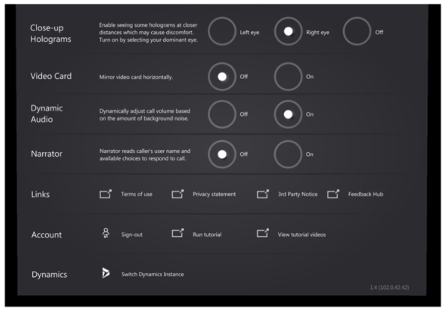

# Overview of Dynamics 365 Remote Assist on HoloLens 2

## Overview of core features

When you launch Remote Assist, you’ll see your recent contacts. When you join a call or meeting, you will see a video card.  

This is the recent contacts page. You can use the tools in the top right corner to access Dynamics bookings, sign out, and adjust settings.

 

This is the settings page. When you’re outside a call, you can navigate to Settings to determine many settings, provide feedback, view the brief tutorial you saw the first time you used Remote Assist, view tutorials on docs.microsoft.com, and switch your Dynamics instance.  

 

This is a video card. When you’re in a call, all the tools are along the top and bottom of the video card. The participant tray displays the avatars of all call participants.  
You can make a one-to-one or group call on Remote Assist call on HoloLens. You can also join a meeting scheduled using Teams or Outlook.  
Remote collaborators can use Microsoft Teams on PC (desktop app only, not web browser) or Microsoft Teams on mobile (iOS or Android).
In a call, remote collaborators can see everything you see – including holograms and the real world behind the holograms – and can annotate your world, insert files into your world, and more.   

A good way to learn the features and voice commands of Remote Assist is to say, “Remote Assist.” (When you’re in a call, the app will display what it believes you said by showing a check mark and “Remote Assist.”) Then, the app will display the name of each button, as you see in the image above. After a few seconds, these labels will automatically disappear. 

There are additional ways to see the label of these buttons. 
* If you’re using Remote Assist on HoloLens 1, extend your arm and hover the ray over the buttons.
*	If you’re using Remote Assist on HoloLens 2 and Remote Assist UI is within your reach, hover your finger over the buttons. If RA UI is out of your reach, extend your arm and hover the ray over the buttons.

As you can see, you also have many options for communicating with remote collaborators. Everyone in the call can annotate your world with arrows  and drawings  using different Colors . (You can “Undo”  or “Delete all”  annotations.) Everyone is also able to send files, which will pop up in your space.  

In addition, you can take a photo of what you see using Camera . 

You can also place the call window wherever you want in your world by toggling Pin/Unpin . 
Remote Assist supports different languages on HoloLens 1 versus HoloLens. Check if your language is supported in Remote Assist here [link to FAQ page].

> Tip
> Remote Assist on HoloLens 1 and HoloLens 2 offer the same capabilities. However, HoloLens 1 gestures differ from HoloLens 2 gestures. Learn how to [navigate HoloLens 1 gestures](https://docs.microsoft.com/en-us/hololens/hololens1-basic-usage) or [navigate Hololens 2 gestures](https://docs.microsoft.com/en-us/hololens/hololens2-basic-usage) before reading the rest of this document.

## This document assumes you:

* Have a subscription to Dynamics 365 Remote Assist and Microsoft Teams
* Have HoloLens running the Windows 10 April 2018 Update
* Have contact using the latest version of [Microsoft Teams](https://products.office.com/en-us/microsoft-teams/group-chat-software?rtc=1) on a PC running Windows 10 or a Microsoft Teams on mobile. Learn about using Teams with Dynamics 365 Remote Assist. [will add link when I publish it]
*	Have an internet connection. At least 1.5 MB of bandwidth is recommended.
*	To connect to Dynamics 365 Field Service from within Dynamics 365 Remote Assist, you’ll need a Dynamics 365 license
* Have installed D365 Remote Assist app on your HoloLens 1 or 2 

## Using HoloLens 1 gestures in Remote Assist 

HoloLens 1 offers several ways to interact with holograms as you navigate the device and various applications. Please read [this](https://docs.microsoft.com/en-us/hololens/hololens1-basic-usage) to learn how to:
* Navigate the Start menu using bloom
*	Select holograms with gaze, airtap, and voice
* Move, resize, and rotate apps
*	and more.

## Using HoloLens 2 gestures in Remote Assist 

Compared to HoloLens 1, HoloLens 2 offers more ways for you to navigate the device and various applications. Please read [this](https://docs.microsoft.com/en-us/hololens/hololens2-basic-usage) to learn how to:
*	Navigate the Start menu by tapping your wrist
*	Select holograms with gaze, airtap, voice, and touch
*	Move, resize, and rotate apps
*	and more.

You can interact with Remote Assist similarly to how you interact with HoloLens 2 Operating System features. For example, 
In Remote Assist, you can select something in three ways.
*	If it’s out of your reach, extend your arm, aim your hand ray, and airtap.    
*	If it’s within your reach, touch it directly. 
*	To use your voice, say “Remote Assist” followed by voice command for that button. A full list of voice commands can be found at the end of the document. The easiest way to see the voice command for Remote Assist features is to say “Remote Assist.” Then, the app will display the name of each button, as you see in the image above. After a few seconds, these labels will automatically disappear. 
