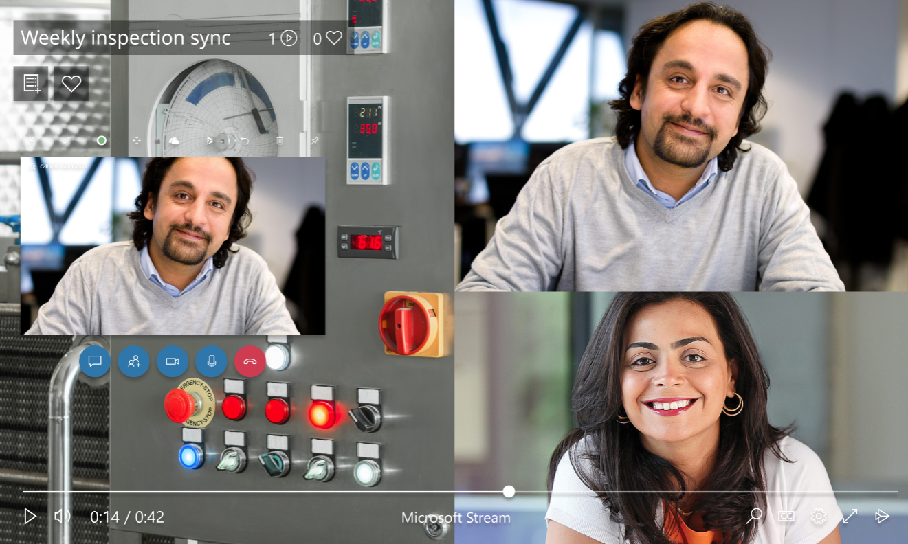
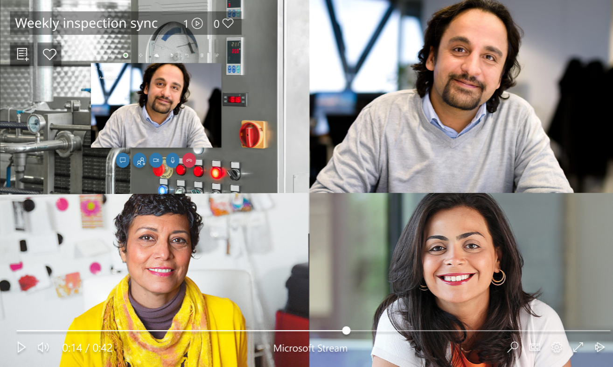

# Record calls in Dynamics 365 Remote Assist on HoloLens 2

Recording a call is great for training or record-keeping purposes.

## Cloud-based recording   

Microsoft Teams desktop supports cloud-based call recording of group calls and meetings, and Microsoft Teams mobile supports cloud-based call recording of meetings only. Recordings are stored via Microsoft Stream. Once the video is uploaded to Stream, all call participants can view a link to Stream via the Teams chat.

Once you’re in a Remote Assist call, the best way to record the call is to ask a collaborator using Teams [desktop]( https://support.office.com/en-us/article/Record-a-meeting-in-Teams-34dfbe7f-b07d-4a27-b4c6-de62f1348c24) or [mobile]( https://support.office.com/en-us/article/Record-a-meeting-in-Teams-34dfbe7f-b07d-4a27-b4c6-de62f1348c24#ID0EAABAAA=Mobile) to record the call. 

> ![Note]
> A Teams desktop user can only record meetings and group calls, not one-to-one calls. A Teams mobile user can only record meetings, not group calls or one-to-one calls. 
When a Teams user starts recording, everyone will be notified that the recording has started. 

When the call ends, or when a Teams user ends the recording, the recording will be uploaded to Stream. After a few minutes, the person who started the recording (“the recorder”) will receive an email from Microsoft Stream when the recording is available. All call participants can view a link to Stream via the Teams chat.

> ![Note]
> The person who initiated the recording (“the recorder”) is the owner of the video and the people in their org who were invited to the meeting are the viewers. The owner needs to [give permission](https://support.office.com/en-us/article/Play-and-share-a-meeting-recording-in-Teams-7d7e5dc5-9ae4-4b94-8589-27496037e8fa#bkmk_sharemeetingrecording) or [download](https://support.office.com/en-us/article/Play-and-share-a-meeting-recording-in-Teams-7d7e5dc5-9ae4-4b94-8589-27496037e8fa#bkmk_downloadmeetingrecording) the video to share the recording beyond these people.  

> ![Note]
>  At this time, a Teams desktop user can record a one-to-one call only if it is initiated using the **Meet Now** feature in the Teams Calendar tab. Learn more about it [here](https://www.microsoft.com/en-us/videoplayer/embed/RWedV7?pid=ocpVideo0-innerdiv-oneplayer&postJsllMsg=true&maskLevel=20&market=en-us) starting at 0:33. A one-to-one call **cannot be recorded** if:
* The Remote Assist (HoloLens and mobile) user initiates the one-to-one call
* The Teams mobile user initiates the call  
*	The Teams desktop user initiates the call using the Teams Call tab

## Cloud-based recording layout 

At this time, the layout of the Teams recording depends on the number of call participants, and the layout cannot be configured. When using Teams to record the call, the Remote Assist HoloLens user’s never occupies the entire recording. If it is imperative that your recording only captures as much of the Remote Assist HoloLens user’s view as possible, and as little of Teams user’s outgoing videos (or avatars), consider using one of the alternative methods of recording listed below. 

Examples listed below.

* In a Teams recording with two participants, each participant’s outgoing video (or avatar) occupies one half of the recording, and both halves are vertical. This means that during a Remote Assist call, a Teams desktop user sees a horizonal slice of what you see, but the recording only captures the middle vertical slice of what you see. Furthermore, during the Remote Assist call, the Teams user only sees their outgoing video feed in the corner of the call, but in the recording, their outgoing video feed occupies half the recording. (If the Teams user turns off their outgoing video feed, their avatar will occupy half the recording.)

*	In a Teams recording with three participants, each participant’s outgoing video (or avatar) occupies one third of the recording. Furthermore, during the Remote Assist call, the Teams user only sees their outgoing video feed in the corner of the call, but in the recording, their outgoing video feed occupies one third the recording. (If the Teams user turns off their outgoing video feed, their avatar will occupy one third of the recording.)

*	In a Teams recording with four or more participants, each participant’s outgoing video (or avatar) occupies one fourth of the recording. During the Remote Assist call, the Teams user only sees their outgoing video feed in the corner of the call, but in the recording, their outgoing video feed occupies one fourth of the recording. (If the Teams user turns off their outgoing video feed, their avatar will occupy one fourth of the recording.)  

* A Teams recording including four or more participants splits the horizonal recording into four, with remaining participants’ avatars in the bottom right corner of the recording. 

 
 

## Alternative methods for recording 

### Use the HoloLens OS to record only what you see in the HoloLens, what you hear around you, and what you hear through the HoloLens speakers

Use this option when:
*	Teams mobile collaborator cannot record the Remote Assist call
*	You only want the recording to capture what you see through when using HoloLens. (For example, the recording will only show the participants in the Remote Assist call if you manually navigate to the participants panel). 

You can use the HoloLens OS to record only what you see in the HoloLens, what you hear around you, and what you hear through the HoloLens speakers. These videos are saved to the HoloLens camera roll. Keep in mind that the video will not be automatically uploaded to Stream, so please follow the instructions for getting a photo or video off HoloLens camera roll. 
1.	In the Start Menu
* Launch the Start menu
* Select the Video button from the bottom tool pane  
*	Airtap when you are ready to record
*	To stop recording, perform the Start Gesture and press the Video button  

2.	By Voice
* Say “Hey Cortana, Record a video”
*	Cortana’s blue ring will show, and your voice command will display on screen while giving feedback by voice
*	There will be a countdown from 3 to 1, when the recording will start
*	There will be red recording indicator in the top right hand corner of your view while the recording is live
*	To stop recording, say “Hey Cortana, Stop recording”
* The video will be available in your Camera Roll. Navigate to your camera roll using the Start menu.
3. Hololens hardware
*	Press and hold the volume up and volume down buttons simultaneously until a three-second countdown begins. To stop recording, tap both buttons simultaneously.
 

3 ways to get a photo or video off HoloLens Camera Roll 
1.	Upload to OneDrive
*	Launch the Start menu. 
*	Select the Windows App Store 
*	Download the OneDrive app    
*	Sign into OneDrive 
*	Upload your file to OneDrive
2.	Manual Connection to PC with a USB-C cable
*	Access the internal storage through Explorer (on a PC)
*	Navigate to the Pictures > Camera Roll folder
*	Copy your images or videos from this folder
3.	If you have Dynamics 365 Remote Assist, you can start a call with someone, open the Text Chat, and attach the picture (but not a video) in the Text Chat.

Learn more about taking photos, taking videos, and getting them off the device [here](https://docs.microsoft.com/en-us/hololens/holographic-photos-and-videos#capture-a-mixed-reality-photo).

### Ask a Teams desktop user to use the Windows Game Bar to capture a screen recording of Remote Assist call from their perspective

Use this option when:
*	Teams desktop collaborator cannot record the Remote Assist call
*	You want the recording to include Teams UI (e.g. Teams UI indicates the participants on the call).

1. On a [!include[pn-ms-windows-short](../includes/pn-ms-windows-short.md)] 10 desktop PC, join a call using [!include[pn-microsoft-teams](../includes/pn-microsoft-teams.md)].

2. Press **Windows logo key  + G** to open the Game bar.

   

3. Select the **Start Recording** button (or press **Windows logo key  + Alt + R**).

   A small recording menu will appear that shows that the recording is in progress.
   
   
   
4. To stop recording, select the **Stop Recording** button.

   The video of the recording will appear in your **Videos/Captures** folder.
   
[Learn more about the Game bar.](https://support.xbox.com/xbox-on-windows/social/record-game-clips-game-bar-windows-10)
