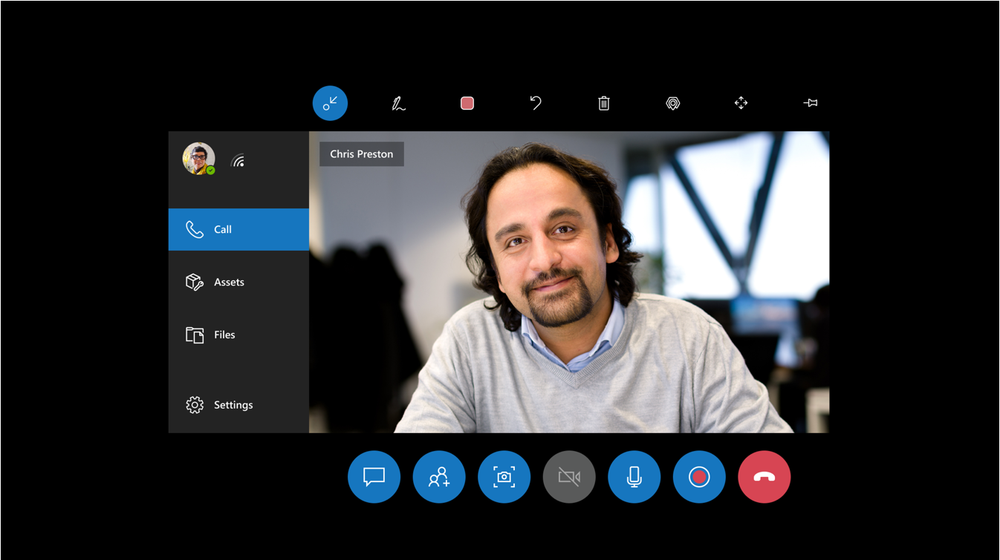
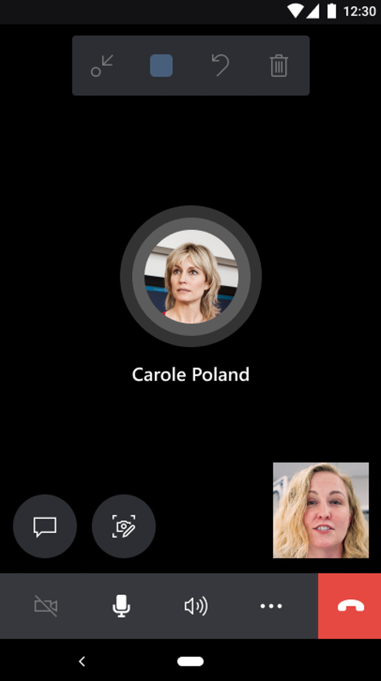
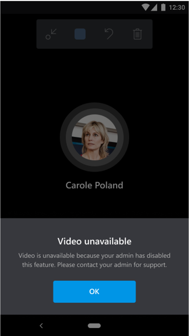
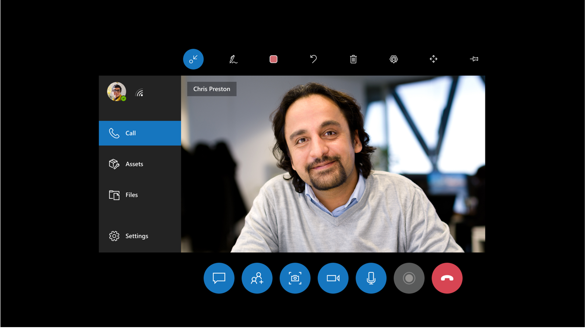
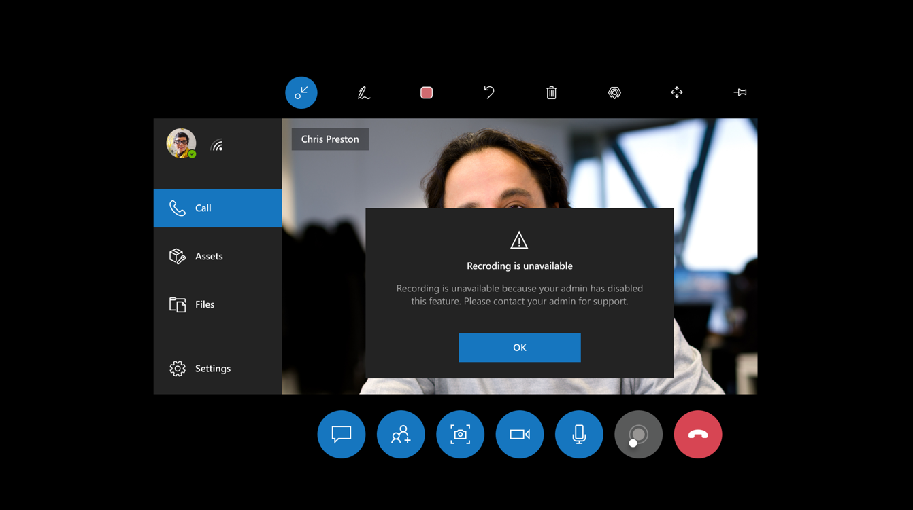
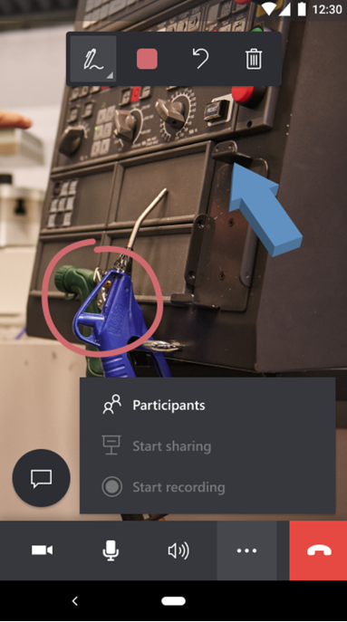
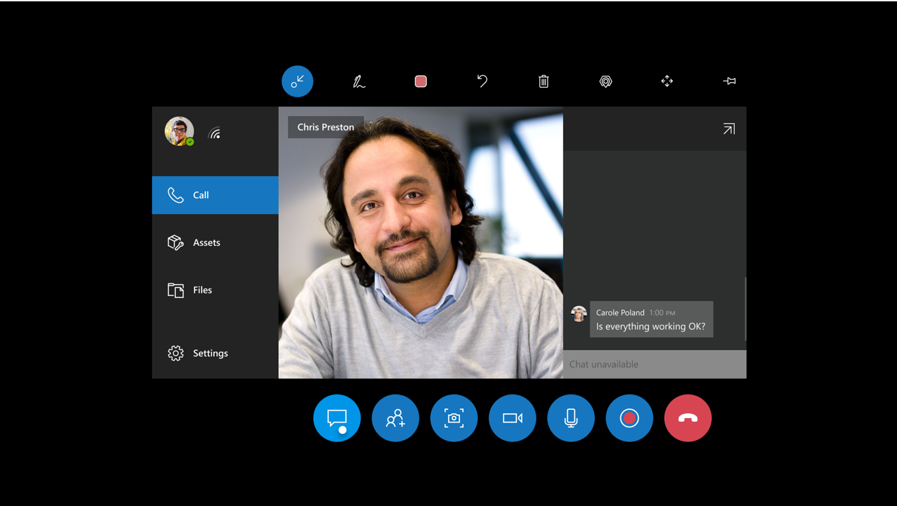
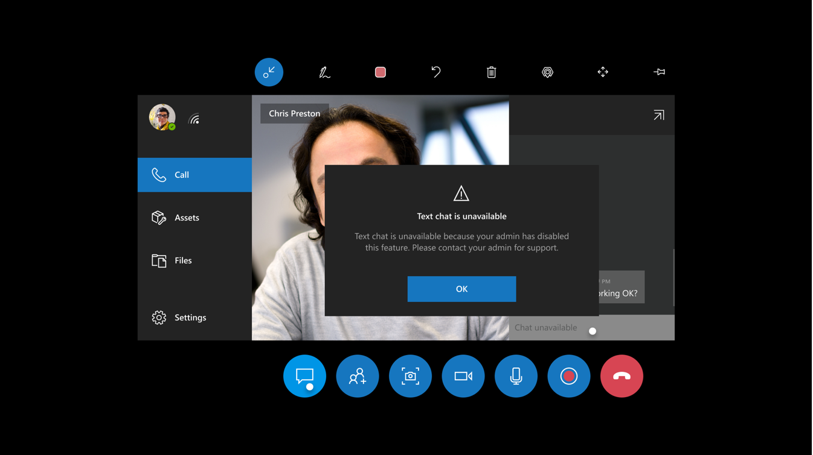
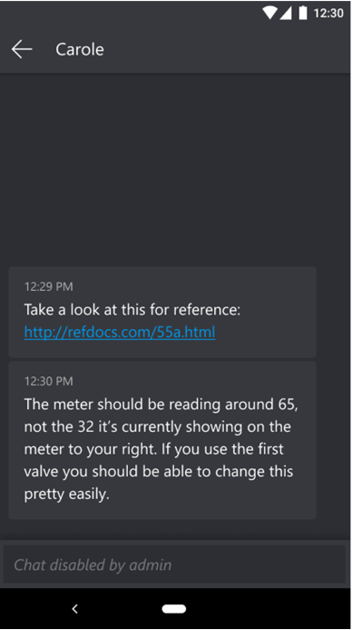
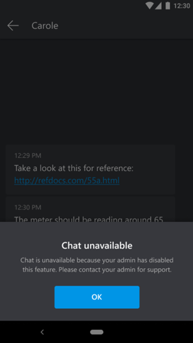

# Microsoft Teams policies supported by Dynamics 365 Remote Assist

Dynamics 365 Remote Assist supports the following Microsoft Teams policies: 

- Video
- Call recording
- Chat messaging
 
Users in your organization will automatically get the global policy unless you create and assign a custom policy. You can edit the settings in the global policy or 
create and assign one or more custom policies to turn the features that you want on or off.  

> [!NOTE]
> You can't set policies for specific applications (for example, Dynamics 365 Remote Assist vs. Teams).  

## Video policies

Video policies are used to control video stream capabilities. Video policies do not disable:

- The camera because the user can use Mixed Reality Capture (MRC)
- The low-bandwidth feature
- The Asset Capture feature 

> [!IMPORTANT]
> If video is disabled, users will not be able to see mixed-reality annotations from remote participants.  

### User experience in the HoloLens app

When video is disabled, the **Video** button is unavailable.

If the user selects the **Video** button, they see the following message that explains why outgoing video is unavailable.

### User experience in the mobile app

When video is disabled, the **Video** button is unavailable and the Mixed Reality toolbar is also unavailable.

If the user selects the **Video** button, they see the following message that explains why video is unavailable.

## Call recording policies 

Call recording policies are used to control call-recording capabilities. This allows admins to disable call recording for privacy purposes. If call recording is disabled through policy, the Dynamics 365 Remote Assist user will not be able to start a recording.  

> [!NOTE]
> This policy does not affect other participants on a call. Other participants might still be able to start/stop recordings.  

### User experience in the HoloLens app

When call recording is disabled, the **Recording** button is unavailable.

If the user selects the **Recording** button, they see the following message that explains why recording is not available.  
 

### User experience in the mobile app

When call recording is disabled, the **Start recording** command is unavailable.

If the user selects the **Start recording** command, they see the following message that explains why recording is not available.

## Chat messaging policies

Chat messaging policies are used to control which chat and channel messaging features are available to users (owners and members) in Microsoft Teams.  

Chat messaging policies in Dynamics 365 Remote Assist allow users to read but not send chat messages. Voice recording and photo capture are also disabled since these features require chat. If chat messaging is disabled through a policy, the Dynamics 365 Remote Assist user will not receive incoming chat messages from Teams. 

## User experience in the HoloLens app

When chat messaging is disabled, the user sees **Chat unavailable** in the Chat window.  

 
If the user tries to enter text in the chat window, they see the following message that explains why chat messaging is unavailable.

## User experience in the mobile app

When chat messaging is disabled, the **Chat** button is unavailable.

If the user tries to select the **Chat** button, they see the following message explaining why chat messaging is unavailable. 

