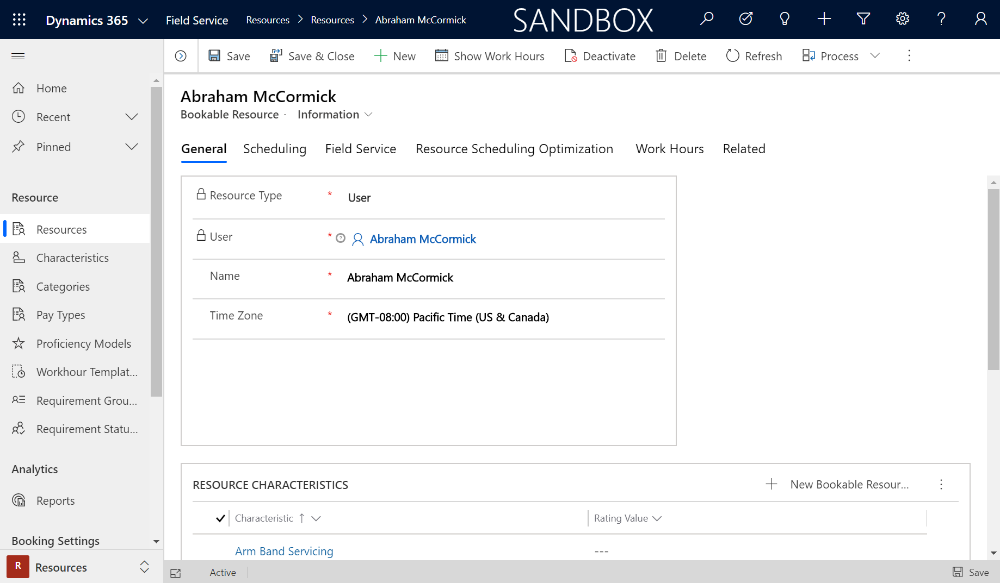
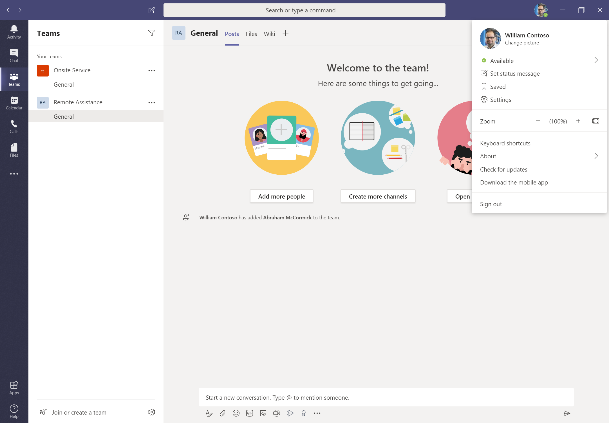
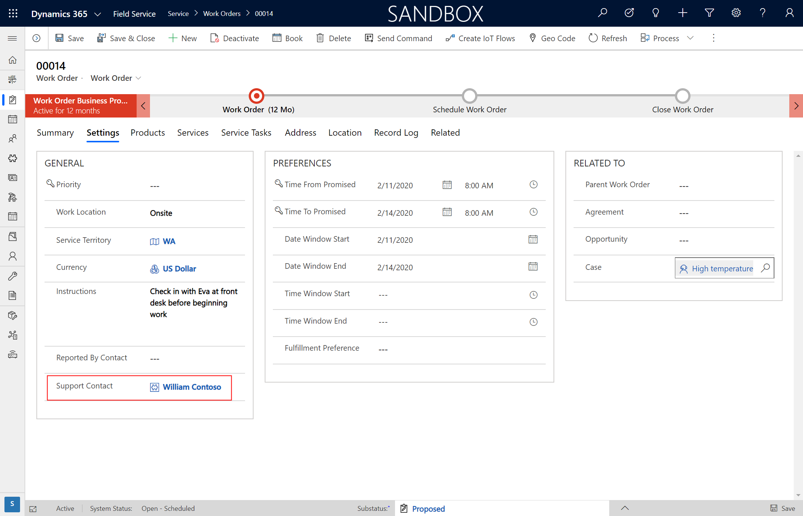
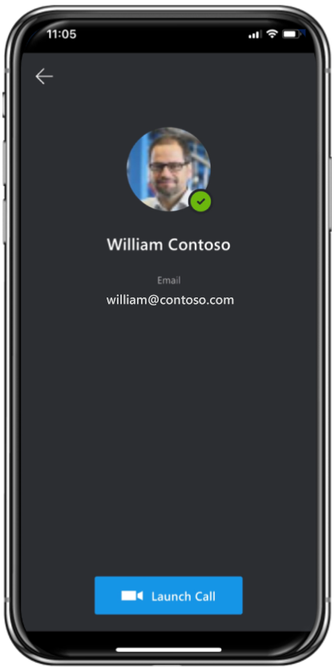
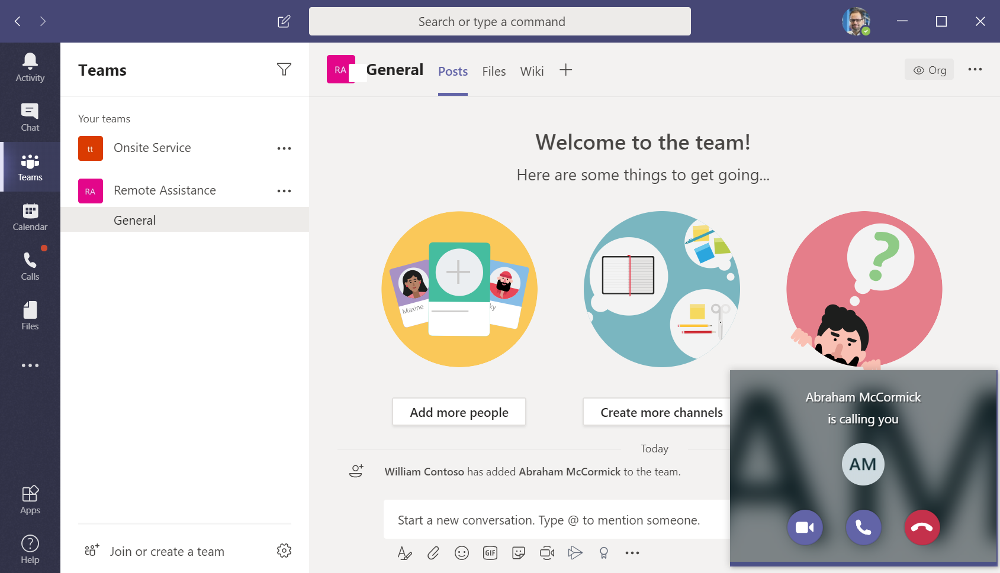

# Integrate Dynamics 365 Remote Assist with Field Service  

use podcast for introduction: https://msit.microsoftstream.com/video/11b57eda-89d6-425b-bb97-3f41d8c6fac7

- deeplink
- see relevant work order information
- post call information to work order timeline

In this article we will explore how a field technician can use the Remote Assist Mobile app to make a call to an expert for help to complete a work order. This article will also explore considerations for field technicians that use Remote Assist on a HoloLens.

> [!div class="mx-imgBorder"]
> 

## Prerequisites
	- Licenses
	- Version 

Before you begin, make sure you have the following set up:

- A [!include[cc-microsoft](../includes/cc-microsoft.md)] [!include[pn-azure](../includes/pn-azure.md)] tenant with a [!include[pn-dyn-365](../includes/pn-dyn-365.md)] subscription **and** a [!include[pn-dyn-365-remote-assist](../includes/pn-dyn-365-remote-assist.md)] subscription. Both are required—[!include[pn-dyn-365-remote-assist](../includes/pn-dyn-365-remote-assist.md)] is not included in any [!include[pn-dyn-365](../includes/pn-dyn-365.md)] bundle.

  > [!NOTE]  
  > The tenant can have more than one [!include[pn-dyn-365](../includes/pn-dyn-365.md)] instance. [!include[pn-dyn-365-remote-assist](../includes/pn-dyn-365-remote-assist.md)] has the option to select an instance from within the app.

- You must have admin access to add or update the [!include[pn-dyn-365](../includes/pn-dyn-365.md)] tenant instance.
- The [!include[pn-dyn-365](../includes/pn-dyn-365.md)] instance must have the [!include[pn-dyn-365-field-service](../includes/pn-dyn-365-field-service.md)] app installed, and it must include the **My In Progress Bookings** view. To make sure this view is installed, we recommend [!include[pn-dyn-365-field-service](../includes/pn-dyn-365-field-service.md)] version 8.2 or later. This topic describes how to make sure you have the correct version and view.
- The tenant must have at least two user accounts.
- The user accounts must have the following licenses assigned:
  - [!include[pn-office-365](../includes/pn-office-365.md)] license that includes [!include[cc-microsoft](../includes/cc-microsoft.md)] [!include[pn-teams](../includes/pn-teams.md)]
  - [!include[pn-dyn-365-remote-assist](../includes/pn-dyn-365-remote-assist.md)]
  - A [!include[pn-dyn-365](../includes/pn-dyn-365.md)] license that includes [!include[pn-dyn-365-field-service](../includes/pn-dyn-365-field-service.md)]

## Set up technician user

 First create a bookable resource that will serve as the technician or front line worker that will use both Field Service on the Field Service Mobile app and Remote Assist on the Remote Assist Mobile app on his or her phone or tablet.

> [!div class="mx-imgBorder"]
> 

The bookable resource must have a **Resource Type = User** and the related user record will need licenses to use both Field Service Mobile and Remote Assist. To set up a field technician to use Field Service Mobile see the topic on [setting up Field Service users and secuirty roles](https://docs.microsoft.com/en-us/dynamics365/field-service/view-user-accounts-security-roles#set-up-a-field-technician-user).

Verify you can log into Field Service Mobile successfully with the field technician user.

> [!div class="mx-imgBorder"]
> 

Next, verify you can log into the Remote Assist mobile app with the same user. 

> [!Note]
> The Remote Assist mobile app is available on mobile devices running iOS and Android with the related ARkit or ARcore capabilities.

> [!div class="mx-imgBorder"]
> 
   

## Set up expert user

As a different user that you have identified as an expert, verify you can sign in to Microsoft Teams. This user does not need a Field Service or Remote Assist license.
   
> [!div class="mx-imgBorder"]
> 

> [!Note]
> The expert must log in to the Microsoft Teams client app on his or her PC or mobile device. Teams on web is not supported.

## Create and schedule work orders

> [!div class="mx-imgBorder"]
> 

> [!div class="mx-imgBorder"]
> 

## View work orders on Field Service Mobile

> [!div class="mx-imgBorder"]
> 

- On Mobile, when you deeplink, the contact will be auto selected to call

deeplink is currently on android only

## Make a Remote Assist call

> [!div class="mx-imgBorder"]
> 

> [!div class="mx-imgBorder"]
> 

> [!div class="mx-imgBorder"]
> 

## Post Remote Assist Call to work order

> [!div class="mx-imgBorder"]
> 

> [!div class="mx-imgBorder"]
> 

## View bookings on HoloLens

- On HoloLens it enables a tech to select the name and do an auto search on it

> [!div class="mx-imgBorder"]
> 

### Confirm that the **My In Progress Bookings** view is included

If you have an instance but aren’t sure if the correct view is installed, follow these steps to confirm:

1. Make sure you’re signed in as an admin for the [!include[pn-dyn-365](../includes/pn-dyn-365.md)] instance.

2. Select **Service** > **Settings** > **Customizations** > **Customize the System**.

   
   
3. In the [!include[pn-powerapps](../includes/pn-powerapps.md)] screen, expand **Entities**, expand the **Bookable Resource Booking** entity, and then select **Views**.

4. In the **Views** screen, verify that the **My In Progress Bookings** view is listed.

   
   
5. Do one of the following:

   - If the view is listed, go to [Add a work order and booking](#add-a-work-order-and-booking) later in this topic.
   
   - If the view is not listed, go to [Upgrade the Dynamics 365 instance](#upgrade-the-dynamics-365-instance), the next procedure in this topic.
   
### Upgrade the Dynamics 365 instance

If the **My In Progress Bookings** view is not listed as described in the previous procedure, you’ll need to upgrade your [!include[pn-dyn-365-field-service](../includes/pn-dyn-365-field-service.md)] version to 8.2 or later. [!include[pn-dyn-365](../includes/pn-dyn-365.md)] upgrades don’t happen automatically; they’re driven by customers. 

To upgrade an instance:

1. Go to the [!include[pn-dyn-365](../includes/pn-dyn-365.md)] Admin Center, select the **Instances** tab, and then select **Solutions** to see which version of [!include[pn-dyn-365-field-service](../includes/pn-dyn-365-field-service.md)] you have. 

   

2. Do one of the following:

   - If you don’t have version 8.2 or later, an **Upgrade** button will appear on the right side of the screen in the **[!include[pn-dyn-365-field-service](../includes/pn-dyn-365-field-service.md)]** box. Select the **Upgrade** button to start the upgrade process. 
   
     If there’s no **Upgrade** button, you can obtain version 8.2 or later by [signing up for a trial](https://appsource.microsoft.com/product/dynamics-365/mscrm.40fd37ef-dca4-4b0d-9f41-d16703b7d070?tab=Overview) or by going to the [Dynamics Insider Portal](http://experience.dynamics.com/insider).

     > [!NOTE]
     > If the [!include[pn-dyn-365-field-service](../includes/pn-dyn-365-field-service.md)] installation fails, you might need to reset or create a new instance. [!include[pn-dyn-365-field-service](../includes/pn-dyn-365-field-service.md)] installation requires specific steps and doing the steps out of order can cause the installation to fail. [Learn more about Dynamics 365 Field Service installation.](https://docs.microsoft.com/dynamics365/customer-engagement/field-service/install-field-service)

   - If the right version of [!include[pn-dyn-365-field-service](../includes/pn-dyn-365-field-service.md)] is installed and the **My In Progress Bookings** view is included, go to [Add a work order and booking](#add-a-work-order-and-booking), the next procedure in this topic.
   
### Add a work order and booking
   
Data will not appear in the **[!include[pn-dyn-365](../includes/pn-dyn-365.md)]** pane in [!include[pn-dyn-365-remote-assist](../includes/pn-dyn-365-remote-assist.md)] unless the following requirements are met:
   
- There must be at least one work order.

- The following fields in the work order must have a value:
   
   |**Field**|**Value**|
   |------------------|---------------------------------------------------------------------------------------------------|
   |System Status|The value for this field must be set to **In Progress**.|
   |Resource|Stores the email address for the [!include[pn-hololens](../includes/pn-hololens.md)] user. This address must match the email address for the [!include[pn-hololens](../includes/pn-hololens.md)] user.|
 
### Create a work order
   
1.	Open the [!include[pn-dyn-365](../includes/pn-dyn-365.md)] instance in your browser.

2.	Select the pull-down menu next to **[!include[pn-dyn-365](../includes/pn-dyn-365.md)]**, select **[!include[pn-field-service](../includes/pn-field-service.md)]**, and then select **New**.

3.	Fill in all fields that contain an asterisk.

    
    
4.	Select **Save** in the lower-right corner of the window.

### Add values for the required fields

1.	Select the **Settings** tab.  

2.	Select the **Book** option at the top of the screen. You use this option to book a time for the resource to perform the work.

3.	In the **Resource** field, enter the resource for the [!include[pn-hololens](../includes/pn-hololens.md)] user. The resource’s email address must match the email address for the [!include[pn-hololens](../includes/pn-hololens.md)] user. If you don’t select a resource or if the email addresses don’t match, data won’t appear in the **[!include[pn-dyn-365](../includes/pn-dyn-365.md)]** pane in [!include[pn-dyn-365-remote-assist](../includes/pn-dyn-365-remote-assist.md)].

4.	Select the booking information, and then set the **Booking Status** field to **In Progress**.

    
    
5.	Make changes to other fields as desired (no other data is required for the data to appear in the **[!include[pn-dyn-365](../includes/pn-dyn-365.md)]** pane in [!include[pn-dyn-365-remote-assist](../includes/pn-dyn-365-remote-assist.md)]).

6.	Save your changes.

### Add custom fields to the **Dynamics 365** pane in Dynamics 365 Remote Assist (optional)

You can customize the **[!include[pn-dyn-365](../includes/pn-dyn-365.md)]** pane in [!include[pn-dyn-365-remote-assist](../includes/pn-dyn-365-remote-assist.md)] by customizing fields, forms, or the **My In Progress Bookings** view in [!include[pn-dyn-365](../includes/pn-dyn-365.md)].

To customize fields, forms, or views in [!include[pn-dyn-365](../includes/pn-dyn-365.md)]:

1. Select **Service** > **Settings** > **Customizations** > **Customize the System**.

   
    
2. Expand **Entities**, open the entity you want to modify, and then select **Fields**, **Forms**, or **Views**, depending on what you want to do. 

The following table shows examples of the types of changes you might want to make in [!include[pn-dyn-365](../includes/pn-dyn-365.md)], and how to make them.

|**To**|**Do this**|**Example**|
|------------------|---------------------------------------------------|--------------------------------------------------------|
|Add a new field that doesn’t already exist in [!include[pn-dyn-365](../includes/pn-dyn-365.md)]|Create the field in the entity you want to edit, and then add that field to the **My In Progress Bookings** view.|In the **Customizations** screen, open the **Work Order** entity, and then add the field you want.  **Note** Make sure to add data to the field. The field won’t appear if there’s no data.|
|Add an existing field to the **My In Progress Bookings** view|In the **My In Progress Bookings** view, add a column for the field. You can add a field from any entity in [!include[pn-dyn-365](../includes/pn-dyn-365.md)].|In the **Customizations** screen, open the **Bookable Resource Booking** entity, select the **My In Progress Bookings** view, and then choose **Add Columns**.  **Note**  Make sure to add data to the field. The field won’t appear if there’s no data.|
|Add a [!include[pn-power-bi](../includes/pn-power-bi.md)] web link. In [!include[pn-hololens](../includes/pn-hololens.md)], when the user selects the link, it will automatically open in the [!include[pn-edge](../includes/pn-edge.md)] browser.|Create a field that supports text strings.|Enter any web link in the field data, such as one that opens a [!include[pn-power-bi](../includes/pn-power-bi.md)] dashboard.  As long as it’s a valid URL, it will automatically become a link.|

## Notes

# Integrate Dynamics 365 Remote Assist with Field Service  

If your organization uses [Dynamics 365 Field Service](https://dynamics.microsoft.com/field-service/overview/?&OCID=AID720979_SEM_yeaT05hp&lnkd=Bing_D365_Brand) to manage [!include[pn-dyn-365-field-service](../includes/pn-dyn-365-field-service.md)] work orders, 
the first-line worker using [!include[pn-hololens](../includes/pn-hololens.md)] can view [!include[pn-dyn-365-field-service](../includes/pn-dyn-365-field-service.md)] bookings from [!include[cc-microsoft](../includes/cc-microsoft.md)] [!include[pn-dyn-365-remote-assist](../includes/pn-dyn-365-remote-assist.md)] and 
quickly call the expert listed in the **Support Contact** field when needed. This enables first-line workers 
to do heads-up, hands-free calling through [!include[pn-hololens](../includes/pn-hololens.md)] in the context of a [!include[pn-dyn-365-field-service](../includes/pn-dyn-365-field-service.md)] booking.

This topic describes:

- Requirements for [!include[pn-dyn-365-field-service](../includes/pn-dyn-365-field-service.md)] integration
- How to make sure [!include[pn-dyn-365-field-service](../includes/pn-dyn-365-field-service.md)] is set up correctly 
- How to upgrade the [!include[pn-dyn-365](../includes/pn-dyn-365.md)] instance if you don’t have the correct [!include[pn-dyn-365-field-service](../includes/pn-dyn-365-field-service.md)] version
- How to add data for required fields in a [!include[pn-dyn-365-field-service](../includes/pn-dyn-365-field-service.md)] work order and booking
- How to customize the **[!include[pn-dyn-365](../includes/pn-dyn-365.md)]** pane that appears in [!include[pn-dyn-365-remote-assist](../includes/pn-dyn-365-remote-assist.md)]
