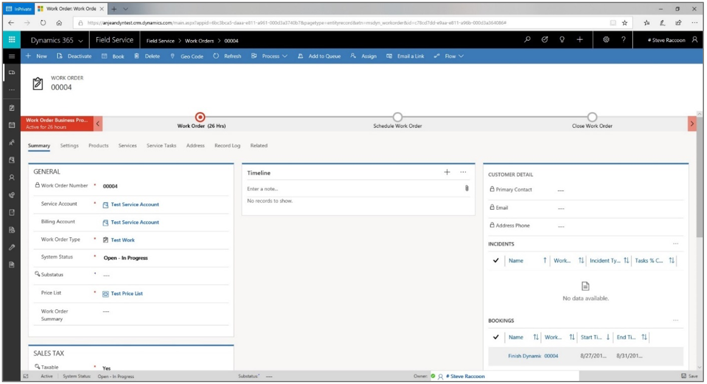
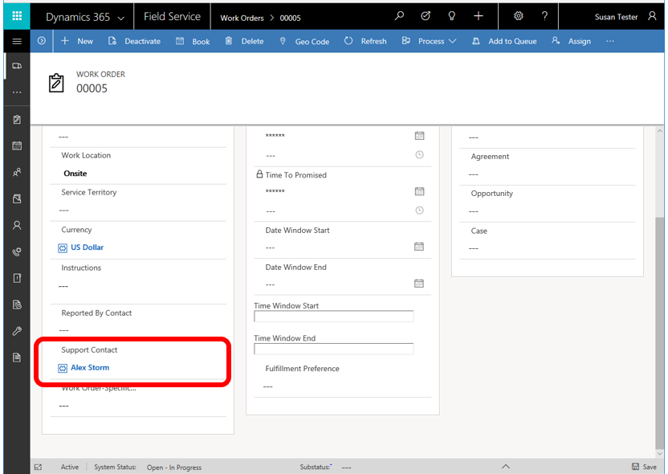
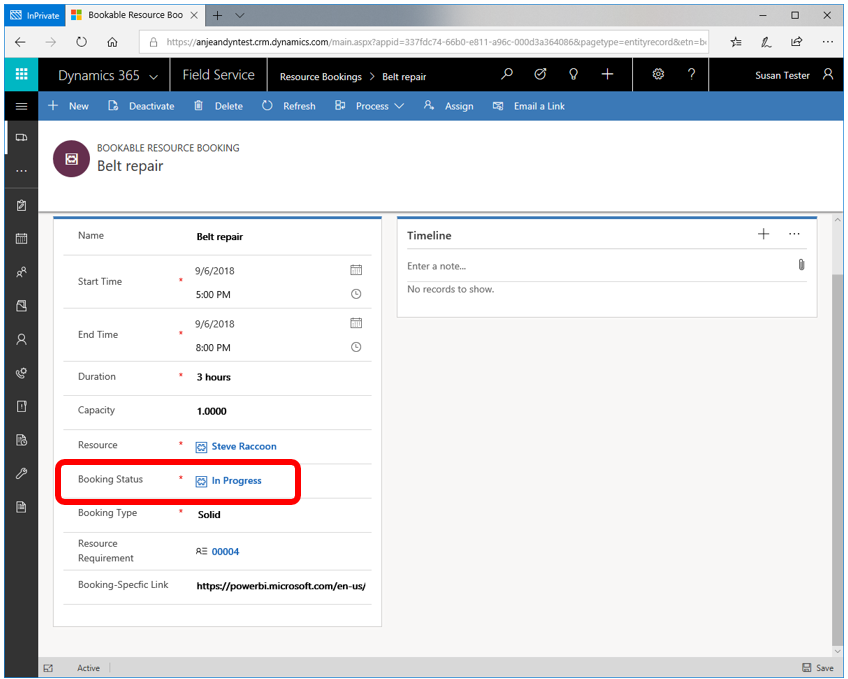

<!--need metadata-->

# Troubleshoot Field Service integration with Dynamics 365 Remote Assist

If your organization uses [Dynamics 365 for Field Service](https://dynamics.microsoft.com/en-us/field-service/overview/?&OCID=AID720979_SEM_yeaT05hp&lnkd=Bing_D365_Brand) to manage field service work orders, 
the first-line worker using HoloLens can view Dynamics 365 for Field Service bookings from Remote Assist and 
quickly call the expert listed in the **Support Contact** field when needed. This enables first-line workers 
to do heads-up, hands-free calling through HoloLens in the context of a Dynamics 365 for Field Service booking.

This topic describes:

- Requirements for Field Service integration
- How to make sure Field Service is set up correctly 
- How to upgrade the Dynamics 365 instance if you don’t have the correct Field Service version
- How to add data for required fields in a Field Service work order and booking
- How to customize the **Dynamics 365** pane that appears in Remote Assist

## Requirements

Before you begin, make sure you have the following set up:

- A Microsoft Azure tenant with a Dynamics 365 subscription **and** a Dynamics 365 Remote Assist subscription. Both are required—Remote Assist is not included in any Dynamics 365 bundle.

  > [!NOTE]  
  > The tenant can have more than one Dynamics 365 instance. Remote Assist has the option to select an instance from within the app.

- You must have admin access to add or update the Dynamics 365 tenant instance.
- The Dynamics 365 instance must have the Field Service app installed, and it must include the **My In Progress Bookings** view. To make sure this view is installed, we recommend Field Service version 8.2 or later. This topic describes how to make sure you have the correct version and view.
- The tenant must have at least two user accounts.
- The user accounts must have the following licenses assigned:
  - Office 365 license that includes Microsoft Teams
  - Remote Assist
  - A Dynamics 365 license that includes Field Service

## Confirm that the **My In Progress Bookings** view is included

If you have an instance but aren’t sure if the correct view is installed, follow these steps to confirm:

1. Make sure you’re signed in as an admin for the Dynamics 365 instance.
2. Select **Service** > **Settings** > **Customizations** > **Customize the System**.

   
   
3. In the PowerApps screen, expand **Entities**, expand the **Bookable Resource Booking** entity, and then select **Views**.   
4. In the **Views** screen, verify that the **My In Progress Bookings** view is listed.

   
   
5. Do one of the following:
   - If the view is listed, go to [Add a work order and booking](#add-a-work-order-and-booking) later in this topic.
   - If the view is not listed, go to [Upgrade the Dynamics 365 instance](#upgrade-the-dynamics-365-instance), the next procedure in this topic.
   
## Upgrade the Dynamics 365 instance

If the **My In Progress Bookings** view is not listed as described in the previous procedure, you’ll need to upgrade your Field Service version to 8.2 or later. Dynamics 365 upgrades don’t happen automatically; they’re driven by customers. 

To upgrade an instance:

1. Go to the Dynamics 365 admin center, select the **Instances** tab, and then select **Solutions** to see which version of Field Service you have. 

   

2. Do one of the following:
   - If you don’t have version 8.2 or later, an **Upgrade** button will appear on the right side of the screen in the **Field Service** box. Select the **Upgrade** button to start the upgrade process. 
     If there’s no **Upgrade** button, you can obtain version 8.2 or later by [signing up for a trial](https://appsource.microsoft.com/en-us/product/dynamics-365/mscrm.40fd37ef-dca4-4b0d-9f41-d16703b7d070?tab=Overview) or by going to the [Dynamics Insider Portal](http://experience.dynamics.com/insider).

     > [!NOTE]
     > If the Field Service installation fails, you might need to reset or create a new instance. Field Service installation requires specific steps and doing the steps out of order can cause the installation to fail. [Learn more about Field Service installation.](https://docs.microsoft.com/en-us/dynamics365/customer-engagement/field-service/install-field-service)

   - If the right version of Field Service is installed and the My In Progress Bookings view is included, go to [Add a work order and booking](#add-a-work-order-and-booking), the next procedure in this topic.
   
## Add a work order and booking
   
Data will not appear in the **Dynamics 365** pane in Remote Assist unless the following requirements are met:
   
- There must be at least one work order.
- The following fields in the work order must have a value:
   
   |**Field**|**Value**|
   |------------------|---------------------------------------------------------------------------------------------------|
   |System Status|The value for this field must be set to **In Progress**.|
   |Resource|Stores the email address for the HoloLens user. This address must match the email address for the HoloLens user.|
   |Support Contact|Stores the name of the suggested expert (the expert that the user calls from HoloLens).|
   
### Create a work order
   
1.	Open the Dynamics 365 instance in your browser.
2.	Select the pull-down menu next to **Dynamics 365**, select **Field Service**, and then select **New**.
3.	Fill in all fields that contain an asterisk.

<!--The following screenshot shows the name Steve Raccoon in two places. Unless you know this is from a Microsoft-approved list of fictitious names, I suggest either blurring it or using a name from this list: https://microsoft.sharepoint-df.com/teams/Dynamics365CustomerEngagementEditingResources/_layouts/15/WopiFrame.aspx?sourcedoc={0ea74ded-c03c-452d-a0de-6c89d54f7107}&action=edit&wd=target%28Style%20Guidelines.one%7C19ceab96-642a-49ba-8020-8958ea8cdb93%2FFictitious%20Names%7C0e4ac149-4669-4c0e-b262-f10ff3158758%2F%29 -->

    
    
4.	Select **Save** in the lower-right corner of the window.

### Add values for the required fields

1.	Select the **Settings** tab.
2.	Enter a value in the **Support Contact** field. This contact will appear in Remote Assist as the expert for the first-line worker to call.

<!--The following screenshot shows the names Susan Tester and Alex Storm. Please see my note above about fictitious names.-->

    
    
3.	Select the **Book** option at the top of the screen. You use this option to book a time for the resource to perform the work.
4.	In the **Resource** field, enter the resource for the HoloLens user. The resource’s email address must match the email address for the HoloLens user. If you don’t select a resource or if the email addresses don’t match, data won’t appear in the **Dynamics 365** pane in Remote Assist.
5.	Select the booking information, and then set the **Booking Status** field to **In Progress**.

<!--Another image that shows the name Susan Tester.-->

    
    
6.	Make changes to other fields as desired (no other data is required for the data to appear in the **Dynamics 365** pane in Remote Assist).
7.	Save your changes.

## Add custom fields to the **Dynamics 365** pane in Remote Assist (optional)

You can customize the **Dynamics 365** pane in Remote Assist by customizing fields, forms, or the **My In Progress Bookings** view in Dynamics 365.

To customize fields, forms, or views in Dynamics 365:

1. Select **Service** > **Settings** > **Customizations** > **Customize the System**.

   
    
2. Expand **Entities**, open the entity you want to modify, and then select **Fields**, **Forms**, or **Views**, depending on what you want to do. 

The following table shows examples of the types of changes you might want to make in Dynamics 365, and how to make them.

|**To**|**Do this**|**Example**|
|------------------|---------------------------------------------------|--------------------------------------------------------|
|Add a new field that doesn’t already exist in Dynamics 365|Create the field in the entity you want to edit, and then add that field to the **My In Progress Bookings** view.|In the **Customizations** screen, open the **Work Order** entity, and then add the field you want.  **Note** Make sure to add data to the field. The field won’t appear if there’s no data.|
|Add an existing field to the **My In Progress Bookings** view|In the **My In Progress Bookings** view, add a column for the field. You can add a field from any entity in Dynamics 365.|In the **Customizations** screen, open the **Bookable Resource Booking** entity, select the **My In Progress Bookings** view, and then choose **Add Columns**.  **Note**  Make sure to add data to the field. The field won’t appear if there’s no data.|
|Add a Power BI web link. In HoloLens, when the user selects the link, it will automatically open in the Edge browser.|Create a field that supports text strings.|Enter any web link in the field data, such as one that opens a Power BI dashboard.  As long as it’s a valid URL, it will automatically become a link.|

### See also

- [Create or edit fields in Dynamics 365](https://docs.microsoft.com/en-us/dynamics365/customer-engagement/customize/create-edit-fields)
- [Create or edit views in Dynamics 365](https://docs.microsoft.com/en-us/dynamics365/customer-engagement/customize/create-edit-views)
