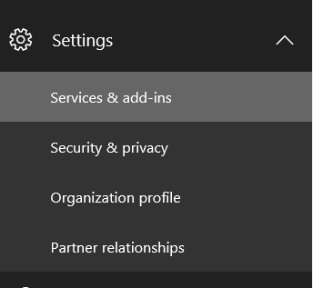
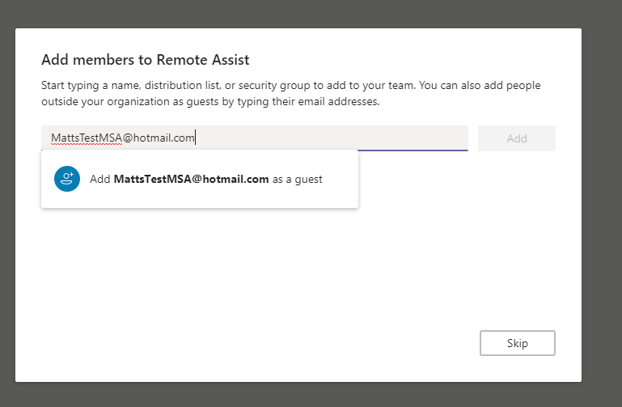

# Set up and use Microsoft Teams with Remote Assist to collaborate on a call

A [!include[cc-microsoft](../includes/cc-microsoft.md)] [!include[pn-dyn-365-remote-assist](../includes/pn-dyn-365-remote-assist.md)] user on [!include[pn-hololens](../includes/pn-hololens.md)] can work collaboratively with a colleague (typically an expert in a particular field) during a video call by using [!include[cc-microsoft](../includes/cc-microsoft.md)] [!include[pn-teams](../includes/pn-teams.md)]. The expert can see everything that the [!include[pn-remote-assist](../includes/pn-remote-assist.md)] user sees, and they can holographically draw
and annotate together. For example, let’s say a first-line worker is servicing a
very complex machine and isn’t sure how to solve a problem. The first-line
worker can call an expert anywhere in the world and have the expert assist with
the servicing using annotations or files.

Setting up this collaboration using [!include[pn-teams](../includes/pn-teams.md)] is simple and it’s free for the
expert.

Need more help? [Check out Remote Assist FAQ](faq.md) for answers to common questions.

[Watch how-to videos](https://go.microsoft.com/fwlink/p/?linkid=2021485) about [!include[pn-remote-assist](../includes/pn-remote-assist.md)].

## What you’ll need

The [!include[pn-remote-assist](../includes/pn-remote-assist.md)] user (first-line worker) on [!include[pn-HoloLens](../includes/pn-HoloLens.md)] needs:

-   [A subscription to Remote Assist.](../licensing/buy-and-deploy.md) The [!include[pn-remote-assist](../includes/pn-remote-assist.md)] subscription includes a subscription to [!include[pn-microsoft-teams](../includes/pn-microsoft-teams.md)].

-   A [!include[pn-hololens](../includes/pn-hololens.md)] running the [Windows 10 April 2018
    Update](https://support.microsoft.com/en-us/help/12643) (or later).

-   An [!include[pn-azure-active-directory](../includes/pn-azure-active-directory.md)] account.

The expert needs:

-   A PC running [!include[pn-ms-windows-short](../includes/pn-ms-windows-short.md)] 10 with the latest version of [Microsoft Teams](https://products.office.com/microsoft-teams/group-chat-software) or a mobile device running [!include[pn-microsoft-teams](../includes/pn-microsoft-teams.md)] Mobile. The expert uses [!include[pn-teams](../includes/pn-teams.md)] to communicate with the [!include[pn-remote-assist](../includes/pn-remote-assist.md)] user on [!include[pn-HoloLens](../includes/pn-HoloLens.md)]. [!include[pn-teams](../includes/pn-teams.md)] may be available [as a free download](https://teams.microsoft.com/downloads).

-   A free [!include[cc-microsoft](../includes/cc-microsoft.md)] account. The expert might already have a [!include[cc-microsoft](../includes/cc-microsoft.md)] account
    if they signed up for the [!include[cc-microsoft](../includes/cc-microsoft.md)] App Store, Skype, Xbox, Hotmail, or
    Outlook.com. If the expert doesn’t already have a [!include[cc-microsoft](../includes/cc-microsoft.md)] account, they
    can sign up for one by going to [https://account.microsoft.com/account](https://account.microsoft.com/account).

## Setup

You can onboard an expert and collaborate using [!include[pn-teams](../includes/pn-teams.md)] in three easy steps:

| **Step** | **Description**                                                                  | **Who does this step?**           |
|----------|----------------------------------------------------------------------------------|-----------------------------------|
|    1.      | Enable guest access for [!include[pn-teams](../includes/pn-teams.md)]                                                    | Administrator                     |
|    2.      | Invite the expert to join a team as a guest using the expert’s [!include[cc-microsoft](../includes/cc-microsoft.md)] account | Administrator or [!include[pn-remote-assist](../includes/pn-remote-assist.md)] user and expert (to download [!include[pn-teams](../includes/pn-teams.md)]) |
|    3.      | Place a call                                                                     | [!include[pn-remote-assist](../includes/pn-remote-assist.md)] user or expert     |

### Step 1: Enable guest access for teams

1.  If you’re the admin for the main [!include[pn-azure](../includes/pn-azure.md)] tenant, go to
    <https://admin.microsoft.com/adminportal/> to open the Office Admin portal,
    and then sign in.

2.  From the menu on the left, select **Show More** \> **Settings** \> **Services & add-ins**.

    

1.  Select **[!include[cc-microsoft](../includes/cc-microsoft.md)] [!include[pn-teams](../includes/pn-teams.md)]** from the list of applications.

    

1.  Select **Settings by user/license type**.

2.  In the drop-down list next to **Select the user/license type you want to
    configure**, select **Guest**.

3.  Set **Turn [!include[cc-microsoft](../includes/cc-microsoft.md)] [!include[pn-teams](../includes/pn-teams.md)] on or off for all users of this type** to **On**,
    and then choose **Save**.

    

4.  Wait an hour for the settings to propagate.

### Step 2: Invite the expert to join a team

1.  In [!include[pn-teams](../includes/pn-teams.md)], select **Join or create a team** to create a team if it doesn’t
    already exist. The [!include[pn-remote-assist](../includes/pn-remote-assist.md)] user and the expert must be on the same
    team to communicate.

    

1.  When asked to add members, enter the expert’s [!include[cc-microsoft](../includes/cc-microsoft.md)] account.

    

    > [!NOTE]
    > If you don’t see the option to add a guest by typing an email address, it’s likely that guest access isn’t enabled on your company’s [!include[pn-azure](../includes/pn-azure.md)] tenant for [!include[pn-teams](../includes/pn-teams.md)]. Enable guest access as described earlier in this topic.

1.  The expert will immediately receive an email message and can click the link
    in the message to open (or download) [!include[cc-microsoft](../includes/cc-microsoft.md)] [!include[pn-teams](../includes/pn-teams.md)]. This version of [!include[pn-teams](../includes/pn-teams.md)]
    is free and is not a trial version.

### Step 3. Place a call

1.  The expert launches the [!include[pn-teams](../includes/pn-teams.md)] app and the [!include[pn-remote-assist](../includes/pn-remote-assist.md)] user on the [!include[pn-hololens](../includes/pn-hololens.md)]
    signs in to their account as usual.

    > [!IMPORTANT]
    > If this is the first time the expert has launched [!include[pn-teams](../includes/pn-teams.md)] and the expert has not been invited to any other teams, [!include[pn-teams](../includes/pn-teams.md)] will automatically take the expert to the correct place. If the expert has been invited to other teams, the expert might need to switch to the appropriate tenant.  
    >     
    > To switch tenants, in the drop-down menu in the upper-right corner of the window, select the appropriate guest tenant:
    
    
       
    > [!NOTE]
    > [!include[pn-teams](../includes/pn-teams.md)] might take a few seconds to reload.
    
1.  Either party can make the call. You might need to search contacts to find
    the right person.

    > [!NOTE]
    > The guest can call any member on the same team. To extend this functionality, invite any other members within your company who would benefit from being able to access this new expert.

## Working with annotations

Once [!include[pn-teams](../includes/pn-teams.md)] is installed, the expert can make video calls to (and receive them
from) contacts using [!include[pn-remote-assist](../includes/pn-remote-assist.md)] on a [!include[pn-hololens](../includes/pn-hololens.md)].

When in a call, the expert will see the contact’s space—including the
holograms—and can use the Mixed Reality toolbar in the video call window to add
holograms.

## Draw and annotate

### Edit mode

To start annotating a contact’s space, first do one of the following to pause
the video stream and enter edit mode:

-   Select anywhere in the call window.

-   Select one of the items on the Mixed Reality toolbar.

-   Select **Start editing**.

In edit mode, the expert will still see a live stream of the call in the corner
of the app window.

### Add arrows, ink, and files

Use the Mixed Reality toolbar to place arrows, draw, or add files:

-   To add arrows, select **Place arrow**  .

-   To add ink, select **Ink**  .

-   To change the arrow or ink color, select **Pick a color**  .

-   To add a file, select **Insert files** , and then add an image file or a PDF file.

    > [!NOTE]
    > After adding them, images can’t be moved, deleted, or resized by the expert.

### Finish editing

When done annotating, do one of the following to finish editing and return to
live mode:

-   Select **Stop editing**.

-   Select the live video feed in the corner of your screen.

### Make changes to edits

To make changes to edits, do one of the following:

-   While in edit mode, select **Undo** to undo the last action.

-   While in edit mode, select **Erase all**  to erase all of the annotations made during that editing session.

-   While in live mode, select **Erase all**  to erase all of the annotations made during that call.

> [!NOTE]
> Specific drawings or arrows can’t be removed. Only the [!include[pn-hololens](../includes/pn-hololens.md)] user can make changes to or delete pictures added by an expert.

## Share your desktop or a running application with a Remote Assist user

When you share your desktop or running application with a [!include[pn-remote-assist](../includes/pn-remote-assist.md)] user, the user's video feed will change to a solid color. They'll still be able to use all the tools in the toolbar even though their video feed will no longer be displayed.

To share your desktop or a running application:

1. In [!include[pn-teams](../includes/pn-teams.md)], select the **Open share tray** button.

   
   
2. Select the screen you want to share.

> [!NOTE]
> You can only share one application or screen at a time. If you want to share a different screen, select the **Close share tray** button to stop sharing, select a different screen, and then start sharing again.

### See also
[User guide](user-guide.md) 
[How-to videos](https://go.microsoft.com/fwlink/p/?linkid=2021485) 
[FAQ](faq.md) 
