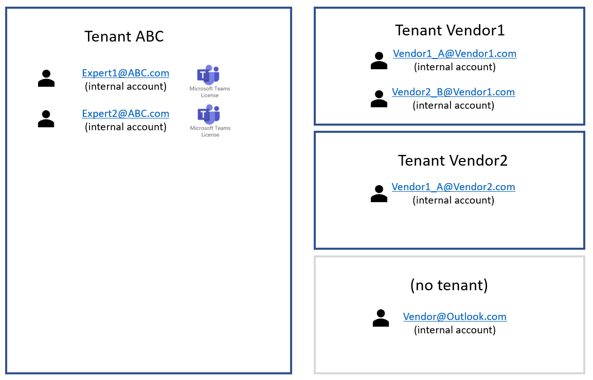

# Vendor and contractor usage of Remote Assist

A Remote Assist call involves one party (technician) using Remote Assist and the other using Teams (expert or remote collaborator).  In most cases, technicians and remote collaborators all belong to the same tenant, and thus a [standard deployment of Remote Assist](deploy-remote-assist.md) and [standard deployment of Teams](set-up-teams.md) is all you need. 

However, there are certain scenarios where this may not be the case: 

1. **Multi-tenant company deployments** - a company has a multi-tenant configuration across different organizations or business units. [Learn more about this scenario.](multi-tenant-deployment.md) 

2. **Vendors and contractors use Remote Assist** - a company wants vendors and contractors that aren’t part of the company tenant to use Remote Assist. This document focuses on this scenario.

> [!Note] This document describes technical steps to enable this scenario. However, additional licensing configuration may be required. To appropriately license vendors and contractors to use Remote Assist, please contact your Microsoft sales representative.

## Account types

Throughout this article, we'll be referring to a few account types: 

1. **Internal account**: An Azure Active Directory (Azure AD) account that is created inside your tenant for internal users.
2. **Service account**: An Azure AD account that is created inside your tenant for users who are not currently part of your tenant.

## Scenario overview

Companies frequently want to leverage non-company employees such as vendors or contractors to perform specific service tasks. In this case, companies still handle all license configuration, but want to enable their vendors or contractors to seamlessly use Remote Assist to collaborate with them. 

## Example

Company ABC wants vendors to use Remote Assist to collaborate with experts in Tenant ABC. As shown in Figure 1.1, some of these vendors are in an existing tenant and others are not. Experts in Tenant ABC already have Teams licenses. Company ABC wants to give vendors Remote Assist licenses so they can use it for their daily service tasks. Company ABC does not want vendors from different vendor companies to talk to each other. 

**Figure 1.1**

In Figure 1.2 below, Company ABC used Azure AD to create **service accounts** (SAs) inside Tenant ABC. Tenant ABC administrator assigned a Remote Assist license to each service account. (A Teams license is then automatically assigned to each service account.) Service account credentials were then distributed to company vendors and contractors. Now,
* (Orange) Vendor1_A@Vendor1.com is still a member of Tenant Vendor1, and now uses Vendor1_A_SA@ABC.com to sign in to Remote Assist to collaborate with Teams users in Tenant ABC.
* (Green) Vendor1_B@Vendor1.com is still a member of Tenant Vendor1, and now uses Vendor1_B_SA@ABC.com to sign in to Remote Assist to collaborate with Teams users in Tenant ABC.
* (Blue) Vendor1_A@Vendor2.com is still a member of Tenant Vendor2, and now uses Vendor2_A_SA@ABC.com to sign in to Remote Assist to collaborate with Teams users in Tenant ABC.
* (Yellow) Vendor@Outlook.com was not a member of any other tenant - that contractor uses a regular personal email (for example, @outlook.com) for work. Now,  Vendor@Outlook.com uses Vendor_SA@ABC.com to sign in to Remote Assist to collaborate with Teams users in Tenant ABC.

**Figure 1.2**

In the previous figure, we described a configuration where any service account user can search for and communicate with any other service account user or internal account user in Tenant ABC. If you need to control search and collaboration, you can do so by adding information barriers. For example, Tenant ABC can configure information barriers such that Vendor1_A@Vendor1.com, Vendor1_B@Vendor1.com, and Vendor1_A@Vendor2.com can search and collaborate with the experts and vice versa, but cannot search and collaborate with Vendor@outlook.com and vice versa. Learn more about information barriers and how to configure them [here](https://docs.microsoft.com/microsoft-365/compliance/information-barriers?view=o365-worldwide).

>[!Note] Because Teams users and Remote Assist users are all in Tenant ABC, they can each search for users they are allowed to search for by typing that user's name, rather than typing their entire email address.

## Implementation

1. Determine if information barriers are necessary

Information barrier policies determine and prevent the following kinds of unauthorized communications between users who have Azure AD accounts in a tenant:

- Searching for a user
- Adding a member to a team
- Starting a chat session with someone
- Starting a group chat
- Inviting someone to join a meeting
- Sharing a screen
- Placing a call

2. If information barriers are necessary, plan how you segment users. 

You can segment users based on different attributes, such as what department they belong to, what Azure AD group they are a member of, or even by their usage location. A full list of attributes can be found [here](https://docs.microsoft.com/microsoft-365/compliance/information-barriers-attributes?view=o365-worldwide#reference). To see how an organization might approach defining segments and policies, consider the following [example](https://docs.microsoft.com/microsoft-365/compliance/information-barriers-policies?view=o365-worldwide#example-contosos-departments-segments-and-policies). A downloadable Excel workbook is available to help you plan and define your segments and policies (and create your PowerShell cmdlets). [Download the workbook (xlsx file).](https://github.com/MicrosoftDocs/OfficeDocs-O365SecComp/raw/public/SecurityCompliance/media/InfoBarriers-PowerShellGenerator.xlsx). Additional information about information barriers can be found [here](https://docs.microsoft.com/microsoft-365/compliance/information-barriers?view=o365-worldwide).

1. Buy the correct licenses

Learn about [licenses required to use Remote Assist](requirements.md).

If you would like to control who the service account user can search and collaborate with, you will need to assign the service account an information barrier license. The following licensing suites include information barrier licenses:

- Microsoft 365 E5
- Office 365 E5
- Office 365 Advanced Compliance
- Microsoft 365 E5 Information Protection and Compliance

For more information, see [Updated list of Information Barrier licenses](https://docs.microsoft.com/microsoft-365/compliance/information-barriers?view=o365-worldwide#required-licenses-and-permissions)

4. [Create service accounts](https://docs.microsoft.com/azure/active-directory/fundamentals/add-users-azure-active-directory).

5. [Assign licenses](https://docs.microsoft.com/azure/active-directory/fundamentals/license-users-groups) to each service account user. 

6. If information barriers are necessary, [configure information barriers](https://docs.microsoft.com/microsoft-365/compliance/information-barriers-policies?view=o365-worldwide).
